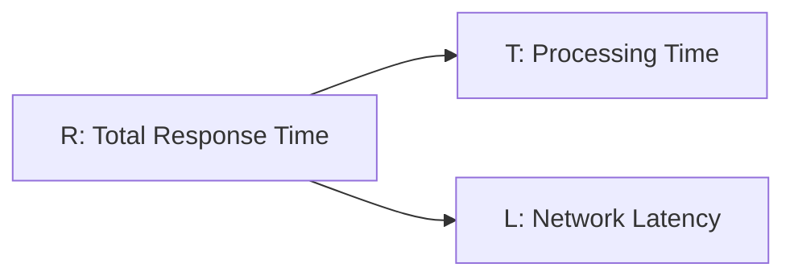

# Sum of Gaussians: an Example

$R = T + L$

$$
T \ and \ L \ are \ independent .\newline T \sim\mathcal{N}(10, \ 2^2) \newline L \sim\mathcal{N}(5, \ 1^2)
$$

$R=(T+L)\sim\mathcal{N}(10+5, \ 4+1) = \mathcal{N}(15, 5)$

$\begin{cases} 
X\sim\mathcal{N}(\mu_X, \sigma^2_X
)
\newline
Y\sim\mathcal{N}(\mu_Y, \sigma^2_Y
)
\end{cases}$

→ $W\sim\mathcal{N}(a\mu_x+b\mu_y,a^2\sigma^2_x+b^2\sigma^2_y)$