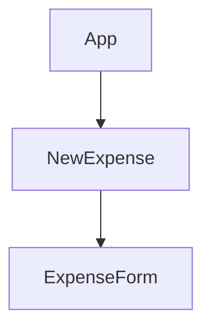

# React.js

Status: In progress
Assign: GenuineLukas
subject: FrontEnd

“React is all about splitting your application into small building blocks, small components, where every building block, every component, has  a clear task and therefore your code stays maintainable and manageable.”

[course code](https://github.com/academind/react-complete-guide-code)

[css positioning](https://www.daleseo.com/css-position/)

[css flexbox](https://css-tricks.com/snippets/css/a-guide-to-flexbox/)

[interview questions](https://www.interviewbit.com/react-interview-questions/#what-is-react)

[CRA](React%20js%200b17a97a02e14143a335a953f8c698a7/CRA%205992e2efc167454eb4c925be20c04191.md)

[User Registration toy project](React%20js%200b17a97a02e14143a335a953f8c698a7/User%20Registration%20toy%20project%204a4272f268b0495baf2e1f4c8ca8e53f.md)

[React Quiz App](React%20js%200b17a97a02e14143a335a953f8c698a7/React%20Quiz%20App%20f2502db3ba96453ab3a603186382e9c5.md)

- todos
    
    01/31/2023
    
    - [ ]  make cart and like button work.
- Document Object Model(DOM) explained
    
    when you `console.log (document);`in the developer tool, there will be a document object printed on the console. When you do the same thing in Node.js, which is being executed on the computer itself(not on the browser), it will say “document is not defined.” **The document object is provided by the window object in the browser.** It will be easier to think of the html code as a blueprint. When this blueprint is sent to the browser(the factory for the reference), browser starts parsing(interpreting) to make a product called DOM. DOM structure is very straight forward as the picture below. please have youself a time to compare the picture and the DOM tree.
    
    
    
    - DOM: the entire tree. (window.document → DOM)
    - Node: the element ( i.e) document ~ li)
- React internal workings
    
    As far as I understand, if any state, props, or context change happens inside React, React would have to re-render the entire DOM every time it does that. Since it should be done by drawing the entire page over and over again, React came up with the idea of ReactDOM(a virtual DOM) which is an exact copy of the real DOM. With that, when the state change happens, the virtual DOM thoroughly gets re-rendered. What ReactDOM does now is that it compares(diffs) the previous ReactDOM with the current one to spy on any change. Once the change is captured, changes in only the changed parts are applied in the real DOM, amplifying the efficiency.
    
    If the parent component is re-executed(by the state change), the child component(s) will be inevitably re-executed as well because they are eventually a function body of a function’s that’s re-executed.
    
- Single-Page-Applications(SPAs)
    
    when working with React we often build so-called Single Page Applications. While we can use React to control parts of an HTML page, let's say some interactive sidebar, and therefore we add a widget, you could say to a page where only a part of the page is controlled with React. It is more common to control the entire page with React, which means that we use React for everything we see on the screen and even for switching pages. So when we click on a link and we load a new page as we do with Netflix when we click on my list, it looks to the user as if he/she switched a [age but he/she actually doesn’t request a new HTML file from the server. Instead, he/she just used JavaScript via React.js to change what’s visible on the screen. And that often leads to a smoother UI and a better user experience.
    
- React.js Alternatives
    
    
    | Angular | React.js | Vue.js |
    | --- | --- | --- |
    | Complete Component-based UI framework, packed with features. Uses TypeScript. Can be overkill for smaller projects. | Lean and focused component-based UI library. Certain features (e.g. routing) are added via community packages. | Complete component-based UI framework, includes most core features. A bit less popular than React & Angular. |
- Components
    - A component in React is just a JavaScript function.
    - To use the component, you need to export it. [how to export?](My%20links%20e8d57c369bcd4d709fe4818867fce7f3/Programming%20d89543ae8de74c34a2b5a59a13186545/%E1%84%80%E1%85%A9%E1%86%BC%E1%84%87%E1%85%AE%2003b256733e564ba4b438846b30834d02/JavaScript%202c9f98085b324ae98e199576bbd836ed/Imports&Exports%20(Modules)%2024b43a7e52fb4038a17798c56acf003b.md)
    - After you import the js file that contains the function (component) you want, you can use the component just like the html tag. [how to import?](My%20links%20e8d57c369bcd4d709fe4818867fce7f3/Programming%20d89543ae8de74c34a2b5a59a13186545/%E1%84%80%E1%85%A9%E1%86%BC%E1%84%87%E1%85%AE%2003b256733e564ba4b438846b30834d02/JavaScript%202c9f98085b324ae98e199576bbd836ed/Imports&Exports%20(Modules)%2024b43a7e52fb4038a17798c56acf003b.md)
    
- label tag (also how the for property is used in React)
    
    label 태그는 무언가의 이름표다. label 안에 들어있는 내용이 누구의 레이블인지를 알고싶다면 label 태그에 for 엘레멘트, 그리고 연계되어있는 특정 태그에 id를 연결지어서 구현한다. 이렇게 하면 레이블의 내용도, 특정 연계된 태그의 내용도 클릭 당했을 때 기능이 어플라이됨.
    
    ```html
    <P>
    	<label for="id_txt">text:</label>
    	<input id="id_txt" type="text" name="id" value="default value">
    </p>
    ```
    
    but in React, for means the normal for loop we are aware of. Thus, we need to replace the for with the “htmlFor” by specifying we are meaning THE htmlFor. 
    
    ```jsx
    const AddUser = (props) => {
    	return (
    		<form>
    			<label htmlFor="username">Username</label>
    			<input id="username" type="text" />
    	</form>
    	);
    };
    ```
    
- need to know
    - JSON.stringyfy
        
        The JSON.stringify() static method converts a JavaScript value to a JSON string.
        
    - fetch()
        
        ```jsx
        // Example POST method implementation:
        async function postData(url = "", data = {}) {
          // Default options are marked with *
          const response = await fetch(url, {
            method: "POST", // *GET, POST, PUT, DELETE, etc.
            mode: "cors", // no-cors, *cors, same-origin
            cache: "no-cache", // *default, no-cache, reload, force-cache, only-if-cached
            credentials: "same-origin", // include, *same-origin, omit
            headers: {
              "Content-Type": "application/json",
              // 'Content-Type': 'application/x-www-form-urlencoded',
            },
            redirect: "follow", // manual, *follow, error
            referrerPolicy: "no-referrer", // no-referrer, *no-referrer-when-downgrade, origin, origin-when-cross-origin, same-origin, strict-origin, strict-origin-when-cross-origin, unsafe-url
            body: JSON.stringify(data), // body data type must match "Content-Type" header
          });
          return response.json(); // parses JSON response into native JavaScript objects
        }
        
        postData("https://example.com/answer", { answer: 42 }).then((data) => {
          console.log(data); // JSON data parsed by `data.json()` call
        });
        ```
        
    - .json()
        
        When a fetch is successful, we read and parse the data using json(), then read values out of the resulting objects as you would expect.
        
        ```jsx
        const myList = document.querySelector("ul");
        const myRequest = new Request("products.json");
        
        fetch(myRequest)
          .then((response) => response.json())
          .then((data) => {
            for (const product of data.products) {
              const listItem = document.createElement("li");
        ```
        
    - Object.values()
        
        The `Objects.values()` static method returns an array of a given object’s own enumerable string-keyed property values.
        
        ```jsx
        const object1 = {
          a: 'somestring',
          b: 42,
          c: false,
        };
        
        console.log(Object.values(object1));
        // Expected output: Array ["somestring", 42, false]
        ```
        

### props

“props” is an abbreviation for properties. though the properties were defined in different components, props can come in handy to grant the users the access to those components.

when make a component by defining a function, you normally get the “props” parameter to get a **set of key&value pairs**. Here, the keys refer to the properties used in the created component that’s used in the App function declaration. 

one component(function) can have only one parameter.

ex)

```jsx
import ExpenseItem from "./components/ExpenseItem";

function App() {
  const expenses = [
    {
      id: "e1",
      title: "Toilet Paper",
      amount: 94.12,
      date: new Date(2020, 7, 14)
    },
    { id: "e2", title: "New TV", amount: 799.49, date: new Date(2021, 2, 12) },
    {
      id: "e3",
      title: "Car Insurance",
      amount: 294.67,
      date: new Date(2021, 2, 28)
    },
    {
      id: "e4",
      title: "New Desk (Wooden)",
      amount: 450,
      date: new Date(2021, 5, 12)
    }
  ];

  return (
    <div>
      <h2>Let's get started!</h2>
      <ExpenseItem
        title={expenses[0].title}
        amount={expenses[0].amount}
        date={expenses[0].date}
      ></ExpenseItem>
      <ExpenseItem
        title={expenses[1].title}
        amount={expenses[1].amount}
        date={expenses[1].date}
      ></ExpenseItem>
      <ExpenseItem
        title={expenses[2].title}
        amount={expenses[2].amount}
        date={expenses[2].date}
      ></ExpenseItem>
      <ExpenseItem
        title={expenses[3].title}
        amount={expenses[3].amount}
        date={expenses[3].date}
      ></ExpenseItem>
    </div>
  );
}

export default App;

-------------------------------------------------------------

import "./ExpenseItem.css";

function ExpenseItem(props) {

  return (
    <div className="expense-item">
      <div>{props.date.toISOString()}</div>
      <div className="expense-item__description">
        <h2>{props.title}</h2>
        <div className="expense-item__price">${props.amount}</div>
      </div>
    </div>
  );
}

export default ExpenseItem;
```

### Card component

sometimes you might use the card components wrap the contents up in some desired ways. When doing this, there are some things you might not want to miss. Card components are a developer-made components, meaning they are not a built-in HTML components. therefore, when making this components by creating `Card.js`, you should include some type of built-in html element inside it. 

```jsx
import React from "react";
import Card from "../UI/Card";
import classes from "./AddUser.module.css";
import Button from "../UI/Button";

const AddUser = (props) => {
  const addUserHandler = (event) => {
    event.preventDefault();
  };

  return (
    <Card className={classes.input}>
      <form onSubmit={addUserHandler}>
        <label htmlFor="username">Username</label>
        <input id="username" type="text" />
        <label htmlFor="age">Age (Years)</label>
        <input id="age" type="number" />
        <Button type="submit">Add user</Button>
      </form>
    </Card>
  );
};

export default AddUser;
```

```jsx
import React from "react";
import classes from "./Card.module.css";

const Card = (props) => {
  return (
    <div className={`${classes.card} ${props.className}`}>{props.children}</div>
  );
};

export default Card;
```

The Card component used in the `AddUser.js` is superficially a built-in-html-element-looking, but it’s actually not. the “ className” property used inside the Card component doesn’t have any functionality unlike when used inside the built-in html component. Thus, in `Card.js`, we need to return a `<div>` , a built-in one, and define the className there using backtick to apply both the style given directly to the div tag and that from `"./AddUser.module.css"`.

### state

whenever the state created by the `useState()` hook is changed, the whole function (by function, I mean component) is getting re-rendered.

when the App.js is rendered on the screen by the index.js, React evaluates all the child nodes only once. → you cannot change the content on the screen by assigning a value to the content already defined and returned. → you need to tell React to re-evaluate the parts you want to make a change to. This is when the “state” comes in handy.

getting the state isn’t that hard. You should import the useState function(hook) from react at the top of the code and call the function right inside the component you are making. useState function is one of the React hooks. Make sure you call it right inside it because it won’t work in any other execution context. useState **returns an array** where the first value is the current state value itself and the second element of the arr is the updating function (the function through which we can update the value).

You have to pass in the “pointer of a function”  to the event listener properties( i.e. onClick) so that React, instead of the user, can call that function whenever the event happened.

```jsx
import React, { useState } from 'react';

import ExpenseDate from "./ExpenseDate";
import "./ExpenseItem.css";
import Card from "../UI/Card";

const ExpenseItem = (props) => {
  //useState returns an array where the first value
  //is the current state value itself and the second element of the arr
  //is the updating function (the function through which we can update the value)
  const [title, setTitle] = useState(props.title);

  const clickHandler = () => {
    setTitle('Updated');
  };
  return (
    <Card className="expense-item">
      <ExpenseDate date={props.date} />
      <div className="expense-item__description">
        <h2>{title}</h2>
        <div className="expense-item__price">${props.amount}</div>
        <button onClick={clickHandler}>Change Title</button>
      </div>
    </Card>
  );
};
```

instead of getting individual states using useState() three times, you could do the following.  The reason why you pass in an anonymous function, instead of an object, inside the `setUserInput()` is because this is necessary when your code is depending on the previous state. If you just use the object inside the function, you don’t know when the state will change, since it’s just scheduled to change. When you use a function inside the `setUserInput()` , though, you will be guaranteed to have the updated previous value when your code need exactly that. ex) counter  

```jsx
const ExpenseForm = () => {
	const [userInput, setUserInput] = useState({
    enteredTitle: "",
    enteredAmount: "",
    enteredDate: ""
  });

  const titleChangeHandler = (prevState) => {
    setUserInput(() => {
      return {
        ...userInput,
        enteredTitle: prevState.target.value
      };
    });
  };
  const amountChangeHandler = (prevState) => {
    setUserInput(() => {
      return {
        ...userInput,
        enteredAmount: prevState.target.value
      };
    });
  };
  const dateChangeHandler = (prevState) => {
    setUserInput(() => {
      return {
        ...userInput,
        enteredDate: prevState.target.value
      };
    });
  };
```

below is the object updating logic used above. 


### Two-way binding

I utilized the two-way binding when I wanted to empty out the content when the form is submitted. Of course, I stored the input data somewhere before emptying out. Since in the form tag, there is a onSubmit listener which is bound with the `submitHandler()`.  By setting the value attribute of each input tag as {enteredTitle}, {enteredAmount}, and {enteredDate} and call the `setEnteredTitle("")`, `setEnteredAmount("")`, and `setEnteredDate("")` at the end of the handler, you can set the default content of the input tags as empty strings easily.

```jsx
const submitHandler = (event) => {
    event.preventDefault();

    const expenseData = {
      title: enteredTitle,
      amount: enteredAmount,
      date: new Date(enteredDate)
    };
    //console.log(expenseData); -> you can check the value is passed via this

    setEnteredTitle("");
    setEnteredAmount("");
    setEnteredDate("");
  };

return (
    <form onSubmit={submitHandler}>
      <div className="new-expense_controls">
        <div className="new-expense_control">
          <label>Title</label>
          <input
            type="text"
            value={enteredTitle}
            onChange={titleChangeHandler}
          />
        </div>
        <div className="new-expense_control">
          <label>Amount</label>
          <input
            type="number"
            value={enteredAmount}
            min="0.01"
            step="0.01"
            onChange={amountChangeHandler}
          />
        </div>
        <div className="new-expense_control">
          <label>Date</label>
          <input
            type="date"
            value={enteredDate}
            min="2019-01-01"
            max="2022-12-31"
            onChange={dateChangeHandler}
          />
        </div>
      </div>
      <div className="new-expense__actions">
        <button type="submit">Add Expense</button>
      </div>
    </form>
  );
};
```

### Child-to-Parent Component Communication (Bottom-up)

props are only passed between a child and a parent. we cannot skip the components in between. 



if you see the underlined part of the code in the two-way binding section, you can clearly see the entered data through the form is being saved in `ExpenseForm.js`. Now, what should we do if we were to send this information up to the hierarchy? we’ve been passing the other way using props though. 

Please focus on the underlined parts in the code below.

```jsx
import React from "react";

import Expenses from "./components/Expenses/Expenses";
import NewExpense from "./components/NewExpense/NewExpense";

const App = () => {
  const expenses = [
    {
      id: "e1",
      title: "Toilet Paper",
      amount: 94.12,
      date: new Date(2020, 7, 14)
    },
    { id: "e2", title: "New TV", amount: 799.49, date: new Date(2021, 2, 12) },
    {
      id: "e3",
      title: "Car Insurance",
      amount: 294.67,
      date: new Date(2021, 2, 28)
    },
    {
      id: "e4",
      title: "New Desk (Wooden)",
      amount: 450,
      date: new Date(2021, 5, 12)
    }
  ];

  const addExpenseHandler = (expense) => {
    console.log('In App.js');
    console.log(expenses);
  }

  // return React.createElement(
  //   'div',
  //   {},
  //   React.createElement('h2', {}, "Let's get started!"),
  //   React.createElement(Expenses, { items: expenses })
  // );

  return (
    <div>
      <NewExpense onAddExpense = {addExpenseHandler}/>
      <Expenses items={expenses} />
    </div>
  );
};

export default App;
```

```jsx
import React from "react";

import ExpenseForm from "./ExpenseForm";
import "./NewExpense.css";

const NewExpense = (props) => {
  const saveExpenseDataHandler = (enteredExpenseData) => {
    const expenseData = {
      ...enteredExpenseData,
      id: Math.random().toString()
    };
    props.onAddExpense(expenseData);
  };

  return (
    <div className="new-expense">
      {/*onSaveExpenseData is a made-by-a-programmer function*/}
      {/*since onSaveExpenseData is also a programmer made function,
        you are expexted to handle that function using props inside the ExpenseForm.js*/}
      <ExpenseForm onSaveExpenseData={saveExpenseDataHandler} />
    </div>
  );
};

export default NewExpense;
```

```jsx
import React, { useState } from "react";

import "./ExpenseForm.css";

const ExpenseForm = (props) => {
  //just for storing the value

  const [enteredTitle, setEnteredTitle] = useState("");
  const [enteredAmount, setEnteredAmount] = useState("");
  const [enteredDate, setEnteredDate] = useState("");

  const titleChangeHandler = (event) => {
    setEnteredTitle(event.target.value);
  };
  const amountChangeHandler = (e) => {
    setEnteredAmount(e.target.value);
  };
  const dateChangeHandler = (e) => {
    setEnteredDate(e.target.value);
  };

  const submitHandler = (event) => {
    event.preventDefault();

    //for storing data
    const expenseData = {
      title: enteredTitle,
      amount: enteredAmount,
      date: new Date(enteredDate)
    };
    //console.log(expenseData); -> you can check the value is passed via this
    props.onSaveExpenseData(expenseData);
    setEnteredTitle("");
    setEnteredAmount("");
    setEnteredDate("");
  };

  return (
    <form onSubmit={submitHandler}>
      <div className="new-expense_controls">
        <div className="new-expense_control">
          <label>Title</label>
          <input
            type="text"
            value={enteredTitle}
            onChange={titleChangeHandler}
          />
        </div>
        <div className="new-expense_control">
          <label>Amount</label>
          <input
            type="number"
            value={enteredAmount}
            min="0.01"
            step="0.01"
            onChange={amountChangeHandler}
          />
        </div>
        <div className="new-expense_control">
          <label>Date</label>
          <input
            type="date"
            value={enteredDate}
            min="2019-01-01"
            max="2022-12-31"
            onChange={dateChangeHandler}
          />
        </div>
      </div>
      <div className="new-expense__actions">
        <button type="submit">Add Expense</button>
      </div>
    </form>
  );
};

export default ExpenseForm;
```

### lifting the state up


### rendering lists of data

through what I did below, we can now change the array and reflect that change on our web application.

```jsx

//same thing, but dynamic
	{props.items.map((expense) => (
	  <ExpenseItem
	    title={expense.title}
	    amount={expense.amount}
	    date={expense.date}
	  />
	))}

//same thing, bu static
	{/*<ExpenseItem
	  title={props.items[0].title}
	  amount={props.items[0].amount}
	  date={props.items[0].date}
	></ExpenseItem>
	<ExpenseItem
	  title={props.items[1].title}
	  amount={props.items[1].amount}
	  date={props.items[1].date}
	></ExpenseItem>
	<ExpenseItem
	  title={props.items[2].title}
	  amount={props.items[2].amount}
	  date={props.items[2].date}
	></ExpenseItem>
	<ExpenseItem
	  title={props.items[3].title}
	  amount={props.items[3].amount}
	  date={props.items[3].date}
	></ExpenseItem>*/}
```

```jsx
import React from "react";

import Expenses from "./components/Expenses/Expenses";
import NewExpense from "./components/NewExpense/NewExpense";

const App = () => {
  const expenses = [
    {
      id: "e1",
      title: "Toilet Paper",
      amount: 94.12,
      date: new Date(2020, 7, 14)
    },
    { id: "e2", title: "New TV", amount: 799.49, date: new Date(2021, 2, 12) },
    {
      id: "e3",
      title: "Car Insurance",
      amount: 294.67,
      date: new Date(2021, 2, 28)
    },
    {
      id: "e4",
      title: "New Desk (Wooden)",
      amount: 450,
      date: new Date(2021, 5, 12)
    }
  ];

  const addExpenseHandler = (expense) => {
    console.log("In App.js");
    console.log(expenses);
  };

  return (
    <div>
      <NewExpense onAddExpense={addExpenseHandler} />
      <Expenses items={expenses} />
    </div>
  );
};

export default App;
```

### using stateful lists

```jsx
import React, { useState } from "react";

import Expenses from "./components/Expenses/Expenses";
import NewExpense from "./components/NewExpense/NewExpense";

const INITIAL_EXPENSES = [
  {
    id: "e1",
    title: "Toilet Paper",
    amount: 94.12,
    date: new Date(2020, 7, 14)
  },
  { id: "e2", title: "New TV", amount: 799.49, date: new Date(2021, 2, 12) },
  {
    id: "e3",
    title: "Car Insurance",
    amount: 294.67,
    date: new Date(2021, 2, 28)
  },
  {
    id: "e4",
    title: "New Desk (Wooden)",
    amount: 450,
    date: new Date(2021, 5, 12)
  },
  {
    id: "e5",
    title: "pencil drawing",
    amount: 300,
    date: new Date(2022, 3, 30)
  }
];

const App = () => {
  const [expenses, setExpenses] = useState(INITIAL_EXPENSES);

  const addExpenseHandler = (expense) => {
    setExpenses((prevExpenses) => {
      return [expense, ...prevExpenses];
    });
  };

  // return React.createElement(
  //   'div',
  //   {},
  //   React.createElement('h2', {}, "Let's get started!"),
  //   React.createElement(Expenses, { items: expenses })
  // );

  return (
    <div>
      <NewExpense onAddExpense={addExpenseHandler} />
      <Expenses items={INITIAL_EXPENSES} />
    </div>
  );
};

export default App;
```

```jsx
{/*when mapping items, you always need to use key
        so the React can understand where to place it without having
        to go through all the items*/}
        {filteredExpenses.map((expense) => (
          <ExpenseItem
            key={expense.id}
            title={expense.title}
            amount={expense.amount}
            date={expense.date}
          />
```

### outputting conditional content

in JavaScript, it evaluates the latter value only if the condition before && is true.

```jsx
{filteredExpenses.length === 0 && <h3>No expenses found.</h3>}{" "}
{filteredExpenses.length > 0 &&
  filteredExpenses.map((expense) => (
    <ExpenseItem
      key={expense.id}
      title={expense.title}
      amount={expense.amount}
      date={expense.date}
    />
  ))}
```

or you could do this

```jsx
let expensesContent = <h3>No expenses found.</h3>; //setting default value
	{/*when mapping items, you always need to use key
        so the React can understand where to place it without having
        to go through all the items*/}
  if (filteredExpenses.length > 0) {
    expensesContent = filteredExpenses.map((expense) => (
      <ExpenseItem
        key={expense.id}
        title={expense.title}
        amount={expense.amount}
        date={expense.date}
      />
    ));
  }

  return (
    <div>
      <Card className="expenses">
        <ExpenseFilter
          selected={filteredYear}
          onFilterYearChange={filterChangeHandler}
        ></ExpenseFilter>
        {expensesContent}
													.
													.
													.
```

we could argue that this is more readable. 

this conditional statement is better dealt with at the highest component tree it physically(visually) appears.

### React component styling

- **handling the styling with an inline styling**
    
    ```jsx
    import React, { useState } from "react";
    
    import Button from "../../UIandButton/Button";
    import "./CourseInput.css";
    
    const CourseInput = (props) => {
      const [enteredValue, setEnteredValue] = useState("");
      const [isValid, setIsValid] = useState(true);
    
      const goalInputChangeHandler = (event) => {
        if (event.target.value.trim().length > 0) {
          setIsValid(true);
        }
        setEnteredValue(event.target.value);
      };
    
      const formSubmitHandler = (event) => {
        event.preventDefault();
        if (enteredValue.trim().length === 0) {
          setIsValid(false);
          //유저가 아무것도 안쳤을 때 방지
          return;
        }
        props.onAddGoal(enteredValue);
      };
    
      return (
        <form onSubmit={formSubmitHandler}>
          <div className="form-control">
            <label style={{ color: !isValid ? "red" : "black" }}>Course Goal</label>
            <input
              style={{
                borderColor: !isValid ? "red" : "black",
                background: !isValid ? "salmon" : "transparent"
              }}
              type="text"
              onChange={goalInputChangeHandler}
            />
          </div>
          <Button type="submit">Add Goal</Button>
        </form>
      );
    };
    
    export default CourseInput; 
    ```
    
    but we are not 100% happy with the inline styles because they take a very high priority and you can certainly always find ways of making it work. But I personally would prefer not to set inline styles. So let’s have a look at an alternative
    
- **how to add styles dynamically without hurting the importance hierarchy**
    
    
    ```css
    .form-control.invalid input {
      border-color: red;
      background: #ffd7d7;
    }
    
    .form-control.invalid label {
      color: red;
    }
    ```
    
    This is when you do what you can do best in React. You specify a goal. You specify some alternatives states, for example, that the goal sometimes is to have just form control and sometimes form control and invalid, and React will make sure that the DOM, the real DOM, is updated accordingly. 
    
    ```jsx
    import React, { useState } from "react";
    
    import Button from "../../UIandButton/Button";
    import "./CourseInput.css";
    
    const CourseInput = (props) => {
      const [enteredValue, setEnteredValue] = useState("");
      const [isValid, setIsValid] = useState(true);
    
      const goalInputChangeHandler = (event) => {
        if (event.target.value.trim().length > 0) {
          setIsValid(true);
        }
        setEnteredValue(event.target.value);
      };
    
      const formSubmitHandler = (event) => {
        event.preventDefault();
        if (enteredValue.trim().length === 0) {
          setIsValid(false);
          //유저가 아무것도 안쳤을 때 방지
          return;
        }
        props.onAddGoal(enteredValue);
      };
    
      return (
        <form onSubmit={formSubmitHandler}>
          <div className={`form-control ${!isValid ? "invalid" : ""}`}>
            <label>Course Goal</label>
            <input type="text" onChange={goalInputChangeHandler} />
          </div>
          <Button type="submit">Add Goal</Button>
        </form>
      );
    };
    
    export default CourseInput;
    ```
    
- **Styled Components**
    
    currently we’re using just CSS for that regular CSS files with regular selectors, mostly class selectors but this does not result in those styles being scoped to a certain component only. so it’s not like we only care about foreign control elements in this component, no, every element on the entire page is affected because by default, those styles are not scoped.
    
    But of course, especially in larger projects, potentially with a lot of developers working on the code, it could happen that a name is used twice.
    
    Once you install the styled component package and import it inside your application, that styled package has methods for all HTML elements. It’s all there and say we need a button. 
    
    ```jsx
    const Button = styled.button'';
    ```
    
    between these back-ticks, we can basically add css codes without classes specified, because even without the specified class name, those styles will be applied to the HTML element rooted from the styled component package. for the pseudo-selectors you can use the ampersand(this always refer back to the component which is being created) symbol that’s supported by the styled component package. 
    
    ```jsx
    import "./Button.css";
    import styled from "styled-components";
    
    const Button = styled.button`
      font: inherit;
      padding: 0.5rem 1.5rem;
      border: 1px solid #8b005d;
      color: white;
      background: #8b005d;
      box-shadow: 0 0 4px rgba(0, 0, 0, 0.26);
      cursor: pointer;
    
      &:focus {
        outline: none;
      }
    
      &:hover,
      &:active {
        background: #ac0e77;
        border-color: #ac0e77;
        box-shadow: 0 0 8px rgba(0, 0, 0, 0.26);
      }
    `;
    
    /*
    const Button = (props) => {
      return (
        <button type={props.type} className="button" onClick={props.onClick}>
          {props.children}
        </button>
      );
    };
    */
    
    export default Button;
    ```
    
    Note that we are not dealing with JSX in this file anymore. if we inspect it in the developers tools, you can see that very weird class added to be precise.
    
    
    
    This is a class name we certainly didn’t set up. This is a class name dynamically generated by the sty;ed components package. What this package does in the end is it looks at the styles we set up here and then it wraps these styles into generated class name, so that it can’t spill over to other components of the app. And it will then add these classes as global CSS. But now since we have unique class names for every styled component, the style set up here will never be able to affect the number of component in the app because these unique class names are really well unique per style component.
    
- **css module**
    
    what css module does is that it takes those CSS classes and a CSS file and basically changes those class names to be unique. For every component it changes the class names off the classes you are importing there.
    
    We have our styles set up in CSS files, but there’s still scoped to components where we use them.
    
    ```jsx
    import React from "react";
    import styles from "./Button.module.css";
    
    const Button = (props) => {
      return (
        <button type={props.type} className={styles.button} onClick={props.onClick}>
          {props.children}
        </button>
      );
    };
    
    export default Button;
    ```
    

### limitations of JSX and how to amend it

JSX is a code that is returned by the components and the JSX will be rendered to the real DOM by React.

**JSX Limitation**

when we have equal to or more than the two elements returned side by side, React will generate an error because we can’t return more than one “root” JSX element (we also can’t store more than one “root” JSX element in a variable).

JSX element actually gets transformed into the `React.createElement` form. Because of the innate limitation of Javascript that it can only return one thing at a time, only one “root” JSX can be returned. Note that the child elements of a root JSX element can be returned by staying inside the root, because they can be translated into the parameters of `React.createElement` form. Example below is invalid JSX.

```jsx
return (
	React.createElement('h2', {}, 'Hi, there!')
	React.createElement('p', {}, 'This does not work :-(')
)
```

**solutions**

1. wrapping the contents with a certain tag.

** Doesn’t have to be a <div> - ANY element will do the trick. 

```jsx
return (
	<div>
		<h2>Hi there!</he>
		<p>Helloooo</p>
	</div>
);
```

When you do this it is possible in bigger apps, you can easily end up with tons of unnecessary <div>s(or other elements) which add no semantic meaning or structure to the page but are only there because of React’s/JSX’ requirement.

1. returning an array instead of the JSX
    
    You simply just wrap the whole JSX contents with [ ] and separate the elements with commas, and since the JSX elements in an array need to have own key value, you as well need to add it one by one, and this is very cumbersome, which makes lots of developers not prefer this method.
    

1. using a Wrapper element (ULTIMATE!)
    
    this is basically the ultimate way to solve the chronic problem of using div’s to wrap all the contents being returned. Firstly, make a wrapper element using the concept of `props.children`. You don’t even use react here.
    
    ```jsx
    const Wrapper = (props) => {
      return props.children;
    };
    
    export default Wrapper;
    ```
    
    and use Wrapper tag where you would normally use div to wrap the content. The real good  facet of this method is that the wrapper tag **does not get rendered to DOM**, which means it shows the same effect as when done with div tag, but in much more economical way.
    

### React Fragments

Fragment basically does the same thing as a Wrapper element. Using a Wrapper element was just a build-up for this technique. Fragment is predefined in react and you can just use it like you would with the wrapper elements.

there are two ways- 

```jsx
<> contents </>
<React.Fragment> contents </React.Fragment>
```

Fragments allow us to write cleaner code, to end up with less unnecessary HTML elements on the final page.

### React Portals


it is not obvious that the Modal should be an overlay(other dialog) to all the other content. It’s a bit like styling a <div> like a <button> and adding an event listener to it: it’ll work, but it’s not a good practice. It’s bad for the accessibility.


We can use React portals to render the modal HTML content somewhere else, where it would normally go to.

**usage**

1.add another div tag above <div id=”root”></div> in the index.html.

```jsx
<div id="overlays"></div> //id really could be anything
```

### React Refs

the ref value always is an object, which always has a current prop and the current prop holds the actual value that ref is connected with. the value of that prop is actually a DOM node that can be manipulated with React.

```jsx
import React, { useState, useRef } from "react";
import Card from "../UI/Card";
import Button from "../UI/Button";
import ErrorModal from "../UI/ErrorModal";
import classes from "./AddUser.module.css";
const AddUser = (props) => {
  const nameInputRef = useRef();
  const ageInputRef = useRef();

  const [error, setError] = useState();

  const addUserHandler = (event) => {
    event.preventDefault();
    const enteredName = nameInputRef.current.value;
    const enteredUserAge = ageInputRef.current.value;
    if (enteredName.trim().length === 0 || enteredUserAge.trim().length === 0) {
      setError({
        title: "Invalid input",
        message: "Please enter a valid name and age (none-empty values)."
      });
      return;
    }
    //force enteredAge to be a number by putting a plus sign
    if (+enteredUserAge < 1) {
      setError({
        title: "Invalid age",
        message: "Please enter a valid age (>0)."
      });
      return;
    }
    props.onAddUser(enteredName, enteredUserAge);
    nameInputRef.current.value = "";
    ageInputRef.current.value = "";
  };

  const errorHandler = () => {
    setError(null);
  };

  return (
    <React.Fragment>
      {error && (
        <ErrorModal
          title={error.title}
          message={error.message}
          onConfirm={errorHandler}
        />
      )}
      <Card className={classes.input}>
        <form onSubmit={addUserHandler}>
          <label htmlFor="username">Username</label>
          <input id="username" type="text" ref={nameInputRef} />
          <label htmlFor="age">Age (Years)</label>
          <input id="age" type="number" ref={ageInputRef} />
          <Button type="submit">Add user</Button>
        </form>
      </Card>
    </React.Fragment>
  );
};

export default AddUser;
```

useRef 훅을 통해서 any html tag와 연결짓고 ref prop을 통해 상태를 받을 수 있다. useState를 이용해서 받는 것보다 더 코드도 짧고 간편하지만 이것은 언제나 우리가 value를 읽는다거나 1차원적인 행동을 할 때 유용하다. ref를 이용하면 그 피이용 컴포넌트는 uncontrolled component가 되어버리는데 그 이유는 우리가 예를 들어 input tag의 내용을 바꾸고 싶으면 위와 같이 수동적으로 바꿔줘야하기 (React를 사용하지 않고) 때문이다. 반대로 useState같이 React로 상태를 바꿔줄 수 있는 것들은 controlled component들을 바꿔준다고 한다. 

- ‘ref’ can be added to any html element.

### “Effect”(or a “Side Effect”)

**Main job of React**: Render UI & React to User Input

- Evaluate & Render JSX
- Manage State & Props
- React to (User) Events & Input
- Re-evaluate Component upon State & Prop changes

**Side Effects**(Literally Everything Else!)

- Store Data in Browser Storage
- Send Http Requests to Backend Servers
- Set & Manage Timers
- so on and so forth…

### Handling Side Effects with the useEffect() Hook

`useEffect()` hook is very useful when you want to show an action in response to something. (ex. user inputs, etc.) 

```jsx
useEffect(()=> {...}, [ dependencies ]);
```

- first param: a function that should be executed AFTER every component evaluation IF the specified dependencies change. (but of course useEffect works for the first render).
    
    페이지 전제가 렌더링 될때 & 디펜던시가 바뀔 때!!
    
    **Your side effect code goes into this function.**
    
- second param: Dependencies of this effect - the function only runs if the dependencies change.
    
    **Specify the dependencies of your function here.**
    
- useEffect() on Login with Local Storage
    
    if we want to know if we’ve logged using react hook we might think of this method using react state.
    
    ```jsx
    const storedUserLoggedInInformation = localStorage.getItem("isLoggedIn");
    
      if (storedUserLoggedInInformation === "1") {
        setIsLoggedIn(true);
      }
    
    //some logic that register isLoggedin, 1 pair
    //to the localStoage everytime we click login button
    ```
    
    But this would result in an infinite loop where the pair value of “isLoggedIn” key is always ‘1’ therefore result infinite rendering of the page.
    
    ```jsx
    useEffect(() => {
        if (storedUserLoggedInInformation === "1") {
          setIsLoggedIn(true);
        }
      }, []);
    ```
    
    if we just use useEffect instead, since there is no dependency specified, we will be able to know if we’ve logged in ( it is in local storage, meaning it’s not lost by re-rendering the page ) and have the desired effect. 
    
- useEffect() & dependencies w/ code example
    - 전 코드
        
        ```jsx
        const emailChangeHandler = (event) => {
            setEnteredEmail(event.target.value);
        
            setFormIsValid(
              event.target.value.includes('@') && enteredPassword.trim().length > 6
            );
          };
        
          const passwordChangeHandler = (event) => {
            setEnteredPassword(event.target.value);
        
            setFormIsValid(
              event.target.value.trim().length > 6 && enteredEmail.includes('@')
            );
          };
        
          const validateEmailHandler = () => {
            setEmailIsValid(enteredEmail.includes('@'));
          };
        
          const validatePasswordHandler = () => {
            setPasswordIsValid(enteredPassword.trim().length > 6);
          };
        
        //onChange: emailChangeHandler, passwordChangeHandler
        //onBlur: validateEmailHandler, ValidatePasswordHandler
        ```
        
        위의 예제를 보면 밸리데이션 로직은 비슷한데 두개의 다른 오커런스: onChange, onBlur에 대해 두 메인 헤들러: changeHandler, validateHandler로 나눠서 체크를 해주고 있다
        
    - 후 코드
        
        ```jsx
        const [enteredEmail, setEnteredEmail] = useState("");
          const [emailIsValid, setEmailIsValid] = useState();
          const [enteredPassword, setEnteredPassword] = useState("");
          const [passwordIsValid, setPasswordIsValid] = useState();
          const [formIsValid, setFormIsValid] = useState(false);
        
          useEffect(() => {
            setFormIsValid(emailIsValid && passwordIsValid);
          }, [emailIsValid, passwordIsValid]);
        
          useEffect(() => {
            validateEmailHandler();
          }, [enteredEmail]);
        
          useEffect(() => {
            validatePasswordHandler();
          }, [enteredPassword]);
        
          const emailChangeHandler = (event) => {
            setEnteredEmail(event.target.value);
          };
        
          const passwordChangeHandler = (event) => {
            setEnteredPassword(event.target.value);
          };
        
          const validateEmailHandler = () => {
            setEmailIsValid(enteredEmail.includes("@"));
          };
        
          const validatePasswordHandler = () => {
            setPasswordIsValid(enteredPassword.trim().length > 6);
          };
        ```
        
    
    According to the code, we need to add everything that the function, the first parameter of the `useState()` hook, use as its dependencies, the second param of the hook. However, there are some exceptions.
    
    - There is no need to add **state updating function** as one of the dependencies. → 리액트는 상태 업데이트 함수(ex. `setFormIsValid`)가 절대 변경되지 않도록 보장하므로.
    - There is no need to add a **built-in function** as one of the dependencies(ex.`fetch`, `localStorage`) 브라우저 API/전역 기능은 React 구성 요소 **렌더링 주기와 관련이 없**으며 변경되지 않는다.
    - There is no need to add **variables or functions you might’ve defined OUTSIDE of your components**(ex. if you create a new helper function in a separate file): Such functions or variables also are no created inside of a component function and hence changing them won’t affect your components.
    
    Long story short: You must add all ‘’things” that could change because your component(or some parent component) re-rendered.
    
    ```jsx
    import { useEffect, useState } from 'react';
     
    let myTimer;
     
    const MyComponent = (props) => {
      const [timerIsActive, setTimerIsActive] = useState(false);
     
      const { timerDuration } = props; // using destructuring to pull out specific props values
     
      useEffect(() => {
        if (!timerIsActive) {
          setTimerIsActive(true);
          myTimer = setTimeout(() => {
            setTimerIsActive(false);
          }, timerDuration);
        }
      }, [timerIsActive, timerDuration]);
    ```
    
    - `timerIsActive` is **added as a dependency** because it's component state that may change when the component changes (e.g. because the state was updated)
    - `timerDuration` is **added as a dependency** because it's a prop value of that component - so it may change if a parent component changes that value (causing this MyComponent component to re-render as well)
    - `setTimerIsActive` is **NOT added as a dependency** because it's that **exception**: State updating functions could be added but don't have to be added since React guarantees that the functions themselves never change
    - `myTimer` is **NOT added as a dependency** because it's **not a component-internal variable** (i.e. not some state or a prop value) - it's defined outside of the component and changing it (no matter where) **wouldn't cause the component to be re-evaluated**
    - `setTimeout` is **NOT added as a dependency** because it's **a built-in API** (built-into the browser) - it's independent from React and your components, it doesn't change
    
- **using timer with useEffect**
    
    this will be significantly helpful when used to send HTTP requests, just any queries happening redundantly. **look at the yellow part
    
    ```jsx
    import classes from "./styles.css";
    import { useState, useEffect } from "react";
    
    export default function App() {
      const [enteredEmail, setEmail] = useState("");
      const [enteredPassword, setPassword] = useState("");
      const [isFormValid, setFormIsValid] = useState(false);
    
      useEffect(() => {
        const timer = setTimeout(() => {
          console.log("Checking form validity");
          setFormIsValid(enteredEmail.includes("@") && enteredPassword.length > 5);
        }, 2000);
    
        return () => {
          console.log("cleanup");
          clearTimeout(timer);
        };
      }, [isFormValid, enteredEmail, enteredPassword]);
    
      const emailChangeHangdler = (event) => {
        setEmail(event.target.value);
      };
    
      const passwordChangeHandler = (event) => {
        setPassword(event.target.value);
      };
    
      return (
        <div className="container">
          <label htmlFor="email">
            email: <input onChange={emailChangeHangdler} className="item" />
          </label>
          <label htmlFor="address">
            address:
            <input alt="address" className="item" />
          </label>
          <label htmlFor="password">
            password:
            <input
              onChange={passwordChangeHandler}
              alt="password"
              className="item"
            />
          </label>
        </div>
      );
    }
    ```
    
- useEffect 정리
    
    **when used with no dependency**
    
    it runs every render cycle. if anything on the screen is rendered, it will run
    
    ```jsx
    useEffect(() => {
    	console.log("Effect running");
    });
    ```
    
    **when used with empty dependency**
    
    it runs the first time the whole app is rendered.
    
    ```jsx
    useEffect(() => {
    	console.log("Effect running");
    , []};
    ```
    
    **when used with dependencies**
    
    it runs the first time the whole app is rendered & when the dependency changes.
    
    ```jsx
    useEffect(() => {
    	console.log("Effect running");
    , [enteredPassword]};
    ```
    
    **when an empty dependency and clean-up function are used together**
    
    ‘effect running’ logs when the whole app is rendered for the first time, and ‘Effect cleanup’ will log when the component is removed from the DOM.(from the screen)
    
    ```jsx
    useEffect(() => {
    	console.log('Effect running');
    	
    	return () => {
    		console.log('Effect cleanup');
    	};
    }.[]);
    ```
    
    *** Whatever is executed inside the return statement inside the useEffect is triggered when the component is “unmounted”, meaning it was removed from the window.
    

### useReducer and Reducers

when your state depends on many other states’ changes, it’s good to consider using useReducer because the evaluation schedule of useState() might mess up your logic.

```jsx
const [state, dispatchFn] = useReducer(reducerFn, initialState, initFn)
```

- useState을 대체할 수 있는 함수
- reducer는 이전 상태와 action을 합쳐, 새로운 state를 만드는 조작을 말한다.
1. state: 컴포넌트에서 사용할 상태
2. dispathFn :
    - 첫번째 인자인 reducer 함수를 실행시킨다.
    - 컴포넌트 내에서 state의 업데이트를 일으키기 위해 사용
3. reducerFn :
    - 컴포넌트 외부에서 state를 업데이트 하는 함수
    - 현재 state, action 객체를 인자로 받아, 기존의 state를 대체하여 **새로운 state를 반환**하는 함수
4. initialState
    - 초기 State
5. init 
    - 초기 함수(초기 state를 조금 지연해서 생성하기 위해 사용)
    
    
    
    - 중첩 속성을 useEffect에 종속성으로 추가하기
        
        **중첩 속성을 useEffect에 종속성으로 추가하기**
        
        이전 강의에서 우리는 `useEffect()`에 객체 속성을 종속성으로 추가하기 위해 dstructuring을 사용했습니다.
        
        `1. const { someProperty } = someObject;
        2. useEffect(() => {
        3.   // code that only uses someProperty ...
        4. }, [someProperty]);`
        
        이것은 **매우 일반적인 패턴 및 접근 방식**이며, 이것이 제가 일반적으로 이 방식을 사용하는 이유이며 여기서 보여드리는 이유입니다(코스 내내 계속 사용할 것입니다).
        
        **핵심은 우리가 destructuring을 사용한다는 것이 아니라**, **전체 개체 대신 특정 속성을** 종속성으로 전달한다는 것입니다.
        
        우리는 이와 같이 코드를 작성할 수도 있으며 **같은 방식으로 작동합니다**.
        
        `1. useEffect(() => {
        2.   // code that only uses someProperty ...
        3. }, [someObject.someProperty]);`
        
        이것은 잘 작동합니다!
        
        하지만 여러분은 이 코드 사용을 **피해야 합니다**:
        
        `1. useEffect(() => {
        2.   // code that only uses someProperty ...
        3. }, [someObject]);`
        
        왜 그럴까요?
        
        왜냐하면 **effect 함수는** `someObject` 가 변경될 때마다 재실행되기 때문이죠 - 단일 속성이 아닙니다 (`someProperty` 위의 예에서)
        

### React Context

[참고](https://react.dev/reference/react/createContext)

### Axios

Axios 통신 세 가지 기법

```jsx
const App = () => {

    const [posts, setPosts] = useState([]);

    useEffect(async () => {
        // axios({
        //     method:'GET',
        //     url:'https://jsonplaceholder.typicode.com/photos'
        // }).then(response => setPosts(response.data))

        // axios.get('https://jsonplaceholder.typicode.com/photos')
        //      .then(response => setPosts(response.data))

        try{
            const response = await axios.get('https://jsonplaceholder.typicode.com/photos');
            setPosts(response.data);
        }catch(error) {
            console.log(error)
        }    
    })
```

### React Memo

React memo is for the optimization of the code. In React, every child component that’s in the parent component gets re-executed when the parent one gets re-executed. Let’s see some occurrences when the Child component gets re-executed.

1. when the Child is just a part of the Parent's function body.
2. when the Child gets props via the Parent(when the prop value changes really).
    1. props are primitive types 
    2. props are object types

re-executing the child every time the parent gets re-rendered is very costly. We want to make the Child re-executed only when the props value actually CHANGES. This is when `React.memo()` comes into play. It compares(by diffing) the previous props’ state and the current props’ state and only when those are different, it re-execute the component.

1. for the primitive props types, we can make that happen just by wrapping our child with `React.memo()` as presented below.
2. for the object props types, `React.memo()` actually does not work because internally(not actually) similar to “===” which returns true for 3 === 3(primitive example) whereas return false for [1,2,3] === [1,2,3](object example). If so, what should we use to acquire that privilege when dealing with object-type props?

```jsx
const Parent = () => {
	return(
		<Child/>
	}
}

//... child
const Child = () => {
	...
}

export default React.memo(Child);
```

### useCallback()

useCallback is the way to prevent a function from re-executing every time the entire page gets re-executed. When using `useCallback()`, as long as the specified dependencies/parameters don’t change, useCallback() will guarantee that the function encompassed by it will stay the same, meaning that 메모리상에서 존재하는 function variable이 pointing 하고 있는 memory 주소가 바뀌지 않는다. 

But why do I need to add some dependencies even though our function(usually the handlers) will not change throughout the program? That is because, in JavaScript,  the function is a closure. 

If your handler function is relying on information from out of the scope, and the information(usually a state) is getting changed, you might want to define that state as one of your useCallback’s dependencies so as for you to create a new function when the state changes, not the function that remain the old state inside it.

```jsx
import { useCallback } from 'react';

function ProductPage({ productId, referrer, theme }) {
  const handleSubmit = useCallback((orderDetails) => {
    post('/product/' + productId + '/buy', {
      referrer,
      orderDetails,
    });
  }, [productId, referrer]);
  // ...
```

### things you have to keep when using useState()

**When our state relies on the previous state**

when we use `useState()`, we set the state through the state-setting function. When we do this, what really happens behind the scenes is that it “schedules” the state to be changed. It might seem to us as a human that the state changes immediately, but it is actually scheduled to change. So there is one thing we have to always keep in mind.

1. when the state relies on the previous state, get the previous state as a function parameter.
    
    ```jsx
    setCounter((prev) => {prev + 1});
    ```
    

This way we will get to use the latest previous state to update our state.

**State Batching**

```jsx
const navigateHanlder = (navPath) => {
	setCurrentnavePath(navPath);
	//State was not updated here!
	setDrawerIsOpen(true);
}
```

When multiple consecutive state-setting functions are called as above, React does what is called ‘State Batching’. this technique schedules only ONE state change even though there are many state changes specified. 

### useMemo()

**Memoization**

`useMemo` 함수에 대해서 알아보기 전에 알고리즘 시간에 자주 나오는 메모이제이션(memoization) 개념에 대해서 잠깐 짚고 넘어가겠습니다. memoization이란 기존에 수행한 연산의 결과값을 어딘가에 저장해두고 동일한 입력이 들어오면 재활용하는 프로그래밍 기법을 말합니다. memoization을 절적히 적용하면 중복 연산을 피할 수 있기 때문에 메모리를 조금 더 쓰더라도 애플리케이션의 성능을 최적화할 수 있습니다.

학술적으로 더 자세한 내용은 [위키피디아](https://en.wikipedia.org/wiki/Memoization)를 참조바라겠습니다.

```jsx
import { useMemo } from 'react';

function TodoList({ todos, tab }) {
  const visibleTodos = useMemo(
    () => filterTodos(todos, tab),
    [todos, tab]
  );
  // ...
}
```

[잘 설명된 내용](https://www.daleseo.com/react-hooks-use-memo/)

### Class-based components

although the functional component way is the modern and encouraged way to build components,  class-based components are out there and you might need to understand the code when you see it.

**Traditionally (React < 16.8), you had to use Class-based Components to manage “State**

**React 16.8 introduced “React Hooks” for Functional Components**

**Class-based Components Can’t Use React Hooks!!!**

- **Props**
    
    ```jsx
    import {Component} from 'react';
    
    class User extends Component {
    	render() {
    		return <li>{this.props.name}</li>;
    	}
    }
    ```
    
    1. props를 사용하기 위해서 Component를 상속 받고 this 키워드를 붙여서 props 를 얻는다.
    2. render() method returns what will be returned from the User component.
- **State**
    
    ```jsx
    import { Component } from 'react';
    
    import User from './User';
    import classes from './Users.module.css';
    
    const DUMMY_USERS = [
      { id: 'u1', name: 'Max' },
      { id: 'u2', name: 'Manuel' },
      { id: 'u3', name: 'Julie' },
    ];
    
    class Users extends Component {
      constructor() {
        super();
        this.state = {
          showUsers: true,
          more: 'Test',
        };
      }
    
      toggleUsersHandler() {
        // this.state.showUsers = false; // NOT!
        this.setState((curState) => {
          return { showUsers: !curState.showUsers };
        });
      }
    
      render() {
        const usersList = (
          <ul>
            {DUMMY_USERS.map((user) => (
              <User key={user.id} name={user.name} />
            ))}
          </ul>
        );
    
        return (
          <div className={classes.users}>
            <button onClick={this.toggleUsersHandler.bind(this)}>
              {this.state.showUsers ? 'Hide' : 'Show'} Users
            </button>
            {this.state.showUsers && usersList}
          </div>
        );
      }
    }
    ```
    
    1. In the Class-based component, your state is always an object. it also has to be a property named “State”! This is not up to you.
    2. inside the setState, you write the state you want to change. This is possible only because it merges the updated state with the old state, not overriding it. So it works when we put an updating function inside the useState. 
        - example
            
            ```jsx
            useState((curState) => {
            		return {showUsers: !curState.showUsers };
            	});
            }
            ```
            
    3. inside the event function such as onClick, etc. `this` keyword can be tricky so we bind this to the prone-to-be-tricky this.
    4. When you add another constructor to your class, you need to call `super()`. superclass inherits the constructor of the parent class.
- **Lifecycle methods**
    
    componentDidMount() → called once component mounted (was evaluated & rendered) `useEffect(…, [])` 
    
    componentDidUpdate() → called once component updated (was evaluated & rendered) `useEffect(…, [someValue])`
    
    componentWillUnmount() → called right before the component is unmounted (removed from DOM) `useEffect(() ⇒ {return () → {…}}, [])`
    
- Context
- Error Boundary
    
    To use Error Boundary, you need to use a class component. it is not achievable by the functional component.
    
    ```jsx
    import { Component } from 'react';
    
    class ErrorBoundary extends Component {
      constructor() {
        super();
        this.state = { hasError: false };
      }
    
      componentDidCatch(error) {
        console.log(error);
        this.setState({ hasError: true });
      }
    
      render() {
        if (this.state.hasError) {
          return <p>Something went wrong!</p>;
        }
        return this.props.children;
      }
    }
    
    export default ErrorBoundary;
    ```
    

### HTTP Requests

- Callback
    
    
    
    we cannot say that val alone is a callback function. Here though,  val function is an argument to a function and called in side that function. In this kind of context, we call the val function the callback function.
    
    examples of callback function
    
    ```jsx
    const words = ['spray', 'limit', 'elite', 'exuberant', 'destruction'];
    
    const result = wprds.filter(word => word.length > 6);
    
    console.log(result);
    ```
    
    the highlighted part is a callback function.
    
    우리는 순차적으로 실행되는 것을 synchronous 하다고 한다.
    
    예) 
    
    ```jsx
    console.log(1);
    console.log(2);
    console.log(3);
    console.log(4);
    ```
    
    
    
    Asynschronous enables the parallel programming possible in single thread JavaScript.
    
    Asychronous 함수란? 호출부에서 실행 결과를 기다리지 않아도 되는 함수. 반대로 Synchronous 함수는 호출부에서 실행 결과가 리턴될 때 까지 기다려야 하는 함수.
    
    자바스크립트의 대표적인 비동기 함수로는 setTimeout()이 있는데, 이 함수는 두 개의 매개 변수를 받고, 내용은 이렇다. → first param: a `callback function` to be executed, second param: `the time has to be waited` before the callback function gets executed in ms.
    
    **비동기 함수에서는 순차적 처리가 보장되지 않는다.
    
    ```jsx
    function findUser(id){
    	let user;
    	setTimeout(function () {
    		console.log("waited 0.1 sec.");
    		user = {
    			id: id,
    			name: "User" + id,
    			email: id + "@test.com",
    		};
    	}, 100);
    	return user;
    }
    
    const user = findUser(1);
    console.log("user: ", user);
    
    /*
    OUTPUT
    user: undefined
    waited 0.1 sec.
    */
    ```
    
    코드를 실행해보면 예상치 못한 순서로 코드가 실행됨을 알 수 있다. 이런 상황에서는 콜백 함수를 이용해서 문제를 해결할 수 있다. 함수로부터 결과값을 리턴 받기를 포기하고, 결과값을 이용해서 처리할 로직을 콜백에 담아 인자로 던지자.
    
    ```jsx
    function findUserAndCallBack(id, cb) {
      setTimeout(function () {
        console.log("waited 0.1 sec.");
        const user = {
          id: id,
          name: "User" + id,
          email: id + "@test.com",
        };
        cb(user);
      }, 100);
    }
    
    findUserAndCallBack(1, function (user) {
      console.log("user:", user);
    });
    /*
    OUTPUT
    waited 0.1 sec.
    user: {id: 1, name: "User1", email: "1@test.com"}
    */
    ```
    
    **하지만 자바스크립트 프로젝트가 점점 더 복잡해지면서  최근에는 콜백 함수를 인자로 넘겨서 비동기 처리를 하는 스타일을 피하는 추세이다. 콜백 함수를 중첩해서 사용 → 가독성 떨어짐. → `Promise`, `async/await` 를 이용.
    
- Promise
    
    ES6에서 Promise를 도입.
    
    프로미스는 현재에는 당장 얻을 수는 없지만 가까운 미래에는 얻을 수 있는 어떤 데이터에 접근하기 위한 방법을 제공한다. 
    
    - We use Promise to a some asynchronous work
    
    ```jsx
    findUser(1).then(function (user) {
      console.log("user:", user);
    });
    
    function findUser(id) {
      return new Promise(function (resolve) {
        setTimeout(function () {
          console.log("waited 0.1 sec.");
          const user = {
            id: id,
            name: "User" + id,
            email: id + "@test.com",
          };
          resolve(user);
        }, 100);
      });
    }
    ```
    
    - Promise 문법
        
        Promise 생성자의 인자는 함수인데 이 함수는 resolve와 reject라는 2개의 함수형 파라미터이다.  resolve( ) 함수의 인자: 미래에 얻게 될 결과. reject() 함수의 인자: 미래에 발생할 예외.
        
        ```jsx
        const promise = new Promise(function(resolve, reject) {...} );
        ```
        
        실제로는 어떤 함수의 리턴값으로 많이 쓰임.
        
        ```jsx
        function returnPromise() {
        	return new Promise((resolve, reject) => {...} );
        }
        ```
        
        나눗셈 예제
        
        ```jsx
        function divide(numA, numB) {
          return new Promise((resolve, reject) => {
            if (numB === 0) reject(new Error("Unable to divide by 0."));
            else resolve(numA / numB);
          });
        }
        ```
        
    - Promise 2
        
        we can create the promise using new keyword and the Promise() gets callback function as its parameter.
        
        Promise status
        
        - pending
        - fulfilled
        - rejected
        
        methods
        
        - then()
        - catch()
        - finally()
        
        ```jsx
        const myPromise = new Promise((resolve, reject) => {
        	setTimeout(() => {
        			const text = prompt('enter "hello"');
        			if(text === "hello"){
        					resolve('💻');
        			}else{
        					reject('error message!');
        			}
        	}, 2000)
        });
        
        myPromise
        			.then((result) => {
        					console.log('result: ', result);
        			})
        			.catch((err) => {
        					console.log('err: ', err);
        			})
        			.finally(() => {
        					console.log('finally!!');
        			})
        ```
        
        ```jsx
        function job1(){
        		return new Promise(function(resolve, reject){
        				setTimeout(function(){
        						resolve('job1 ok!');
        				}, 2000);
        		});
        }
        
        function job2(){
        		return new Promise(function(resolve, reject){
        				setTimeout(function(){
        						resolve('job2 ok!');
        				}, 2000);
        		});
        }
        
        job1().then(function(data){
        					console.log('data1', data); //job1 ok!
        					return job2;				
        			}).then(function(data){
        					console.log('data2', data); 
        			});
        ```
        
- about `fetch()`
    
    `fetch()` method is a global method in both `[Window](https://developer.mozilla.org/en-US/docs/Web/API/Window)` and `[Worker](https://developer.mozilla.org/en-US/docs/Web/API/WorkerGlobalScope)` contexts.
    
    `fetch()` 함수는 API의 URL을 인자로 받고, 미래 시점에 얻게될 API 호출 결과를 Promise 객체로 리턴합니다. network latency 때문에 바로 결과값을 얻을 수 없는 상황이므로 위에서 설명한 Promise를 사용 목적에 정확히 부합합니다.
    
    ```jsx
    fetch()
      .then((response) => console.log("response:", response))
      .catch((error) => console.log("error:", error));
    ```
    
    fetch() function’s return value is “A Promise that resolves to a Response object”
    
    The reason why we use Promise is that it provides us the two built in method through which we can take actions according to if a process has failed or succeeded.
    
    Promise.then(callback func_) → when succeed
    
    Promise.catch(callback func_) → When fail
    
    ex)
    
    ```jsx
    const fetched = fetch('https://some-url');
    fetched.then(function(response){
    			//	response.json().then(function(data){
    			//		console.log('data', data);
    			//	});
    				return response.json();
    			})
    			.catch(function(reason){
    						console.log('reason', reason);
    			})
    			.then(function(data){
    						console.log('data', data);
    			});	
    ```
    
    result inside the function(result) is the Response object that got resolved as a result of a Promise.
    
    - `.json()` converts the json format into the javascript object and it also returns Promise.
    
    
    
- async, await
    
    
    
    ES7에서 추가된 async/await
    
    ```jsx
    async function fetchAuthorName(postId) {
      const postResponse = await fetch(
        `https://jsonplaceholder.typicode.com/posts/${postId}`
      );
      const post = await postResponse.json();
      const userId = post.userId;
      const userResponse = await fetch(
        `https://jsonplaceholder.typicode.com/users/${userId}`
      );
      const user = await userResponse.json();
      return user.name;
    }
    
    fetchAuthorName(1).then((name) => console.log("name:", name));
    
    /*
    OUTPUT
    name: Leanne Graham
    */
    ```
    
    1. async 키워드가 function 앞에 붙었다.
    2. Promise를 리턴하는 모든 비동기 함수 호출부 앞에 await 키워드가 붙었다.
    3. await 키워드는 async 키워드가 붙어있는 함수 내부에서만 사용할 수 있으며 비동기 함수가 리턴하는 Promise로 부터 결과값을 추출해준다. 즉, async 키워드를 사용하면 일반 비동기처리처럼 바로 실행이 다음 라인으로 넘어가는 것이 아니라 결과값을 얻을 수 있을 때까지 기다려준다. 따라서 일반적인 동기 코드 처리와 동일한 흐름으로 코드를 작성할 수 있으며, 코드를 일기 수월해짐.
    4. async키워드가 붙어있는 함수를 호출하면 명시적으로 promise 객체를 생성하여 리턴하지 않아도 promise 객체가 리턴된다. 따라서 호출부를 보면 then() 메서드를 사용.
    5. 하지만 이 호출분가 또 다른 async 키워드가 부터있는 함수의 “내부에” 있다면 동일한 방식으로 await 키워드를 사요하여 Promise가 제공할 값에 바로 접근 가능.
        
        ```jsx
        async function printAuthorName(postId) {
          const name = await fetchAuthorName(postId);
          console.log("name:", name);
        }
        
        printAuthorName(1);
        ```
        
    
    **예외 처리**
    
    동기/비동기 구분없이 `try/catch`로 일관되게 예외 처리를 할 수 있는 부분도 async/await를 사용해서 코딩했을 때의 큰 이점 중 하나입니다.
    
    ```jsx
    async function fetchAuthorName(postId) {
      const postResponse = await fetch(
        `https://jsonplaceholder.typicode.com/posts/${postId}`);
      const post = await postResponse.json();
      const userId = post.userId;
    
      try {
        const userResponse = await fetch(
          `https://jsonplaceholder.typicode.com/users/${userId}`);
        const user = await userResponse.json();
        return user.name;
      } catch (err) {
        console.log("Faile to fetch user:", err);
        return "Unknown";
      }
    }
    
    fetchAuthorName(1).then((name) => console.log("name:", name));
    ```
    
- sending get request
    
    you can send the http requests by Jacascript’s `fetch()` function. [Javascript Fetch](https://developer.mozilla.org/ko/docs/Web/API/Fetch_API/Using_Fetch)
    
    This is an example of a star wars API.
    
    ```jsx
    function App() {
        const [movies, setMovies] = useState([]);
        function fetchMoviesHandler() {
            fetch('https://swapi.dev/api/films/')
                .then((response) => {
                    return response.json();
                })
                .then((data) => {
                    const transformedMovies = data.results.map((movieData) => {
                        return {
                            id: movieData.episode_id,
                            title: movieData.title,
                            openingText: movieData.opening_crawl,
                            releaseDate: movieData.release_date,
                        };
                    });
                    setMovies(transformedMovies);
                });
        }
    
      return (
        <React.Fragment>
          <section>
            <button onClick={fetchMoviesHandler}>Fetch Movies</button>
          </section>
          <section>
            <MoviesList movies={movies}/>
          </section>
        </React.Fragment>
      );
    }
    ```
    
    you can also use the async and await keywaord to fetc the data.
    
    ```jsx
    function App() {
        const [movies, setMovies] = useState([]);
        async function fetchMoviesHandler() {
            const response = await fetch('https://swapi.dev/api/films/');
            const data = await response.json();
    
                    const transformedMovies = data.results.map((movieData) => {
                        return {
                            id: movieData.episode_id,
                            title: movieData.title,
                            openingText: movieData.opening_crawl,
                            releaseDate: movieData.release_date,
                        };
                    });
                setMovies(transformedMovies);
            };
    
      return (
        <React.Fragment>
          <section>
            <button onClick={fetchMoviesHandler}>Fetch Movies</button>
          </section>
          <section>
            <MoviesList movies={movies}/>
          </section>
        </React.Fragment>
      );
    }
    ```
    
- Loading data handling
    
    Loading data can be handled in Rect using useState();
    
    ```jsx
    const [isLoading, setIsLoading] = useState(false);
    
    async function fetchMoviesHandler() {
            setIsLoading(true);
            const response = await fetch('https://swapi.dev/api/films/');
            const data = await response.json();
    
            const transformedMovies = data.results.map((movieData) => {
                return {
                    id: movieData.episode_id,
                    title: movieData.title,
                    openingText: movieData.opening_crawl,
                    releaseDate: movieData.release_date,
                };
            });
            setMovies(transformedMovies);
            setIsLoading(false);
        }
    
    //insdie the jsx
    {!isLoading && movies.length  > 0 && <MoviesList movies={movies}/>}
    {!isLoading && movies.length === 0 && <p>Found no movies.</p>}
    {isLoading && <p>Loading...</p>}
    ```
    
- Error Handling
    
    You can also handle the Error with useState().
    
    ```jsx
    function App() {
        const [movies, setMovies] = useState([]);
        const [isLoading, setIsLoading] = useState(false);
        const [error, setError] = useState(null);
        async function fetchMoviesHandler() {
            setIsLoading(true);
            setError(null);
            try {
                const response = await fetch('https://swapi.dev/api/films/');
    
                if(!response.ok) {
                    throw new Error("Something went wrong!")
                }
    
                const data = await response.json();
    
                const transformedMovies = data.results.map((movieData) => {
                    return {
                        id: movieData.episode_id,
                        title: movieData.title,
                        openingText: movieData.opening_crawl,
                        releaseDate: movieData.release_date,
                    };
                });
                setMovies(transformedMovies);
            } catch (error) {
                setError(error.message);
            }
            setIsLoading(false);
        }
    
        let content;
    
        if(movies.length > 0){
            content = <MoviesList movies={movies}/>;
        }
    
        if(error) {
            content = <p>{error}</p>
        }
    
        if(isLoading) {
            content = <p>Loading...</p>
        }
    
      return (
        <React.Fragment>
          <section>
            <button onClick={fetchMoviesHandler}>Fetch Movies</button>
          </section>
          <section>
              {content}
          </section>
        </React.Fragment>
      );
    }
    ```
    
- using useEffect()
    
    You can use useEffect so you can fetch the data right after the user enter the screen.
    
    ```jsx
    function App() {
        const [movies, setMovies] = useState([]);
        const [isLoading, setIsLoading] = useState(false);
        const [error, setError] = useState(null);
    
        const fetchMoviesHandler = useCallback(async() => {
            setIsLoading(true);
            setError(null);
            try {
                const response = await fetch('https://swapi.dev/api/films/');
    
                if(!response.ok) {
                    throw new Error("Something went wrong!")
                }
    
                const data = await response.json();
    
                const transformedMovies = data.results.map((movieData) => {
                    return {
                        id: movieData.episode_id,
                        title: movieData.title,
                        openingText: movieData.opening_crawl,
                        releaseDate: movieData.release_date,
                    };
                });
                setMovies(transformedMovies);
            } catch (error) {
                setError(error.message);
            }
            setIsLoading(false);
        }, []);
    
        useEffect(() => {
            fetchMoviesHandler();
        }, [fetchMoviesHandler]);
    
        let content;
    
        if(movies.length > 0){
            content = <MoviesList movies={movies}/>;
        }
    
        if(error) {
            content = <p>{error}</p>
        }
    
        if(isLoading) {
            content = <p>Loading...</p>
        }
    
      return (
        <React.Fragment>
          <section>
            <button onClick={fetchMoviesHandler}>Fetch Movies</button>
          </section>
          <section>
              {content}
          </section>
        </React.Fragment>
      );
    }
    ```
    
- sending post request
    
    as a second argument of the `fetch()` function, specify that you want to use the ‘POST’ method.
    
    ```jsx
    import React, {useState, useEffect, useCallback} from 'react';
    
    import MoviesList from './components/MoviesList';
    import AddMovie from "./components/AddMovie";
    import './App.css';
    
    function App() {
        const [movies, setMovies] = useState([]);
        const [isLoading, setIsLoading] = useState(false);
        const [error, setError] = useState(null);
    
        const fetchMoviesHandler = useCallback(async() => {
            setIsLoading(true);
            setError(null);
            try {
                const response = await fetch('https://fisrt-react-project-default-rtdb.firebaseio.com/movies.json');
    
                if(!response.ok) {
                    throw new Error("Something went wrong!")
                }
    
                const data = await response.json();
    
                const loadedMovies = [];
    
                for( const key in data) {
                    loadedMovies.push({
                        id: key,
                        title: data[key].title,
                        openingText: data[key].openingText,
                        releaseDate: data[key].releaseDate,
                    })
                }
    
                setMovies(loadedMovies);
            } catch (error) {
                setError(error.message);
            }
            setIsLoading(false);
        }, []);
    
        useEffect(() => {
            fetchMoviesHandler();
        }, [fetchMoviesHandler]);
    
        async function addMovieHandler(movie) {
            const response = await fetch('https://fisrt-react-project-default-rtdb.firebaseio.com/movies.json', {
                method: 'POST',
                body: JSON.stringify(movie),
                headers: {
                    'Content-Type': 'application/json'
                }
            });
            const data = await response.json();
            console.log(data);
        }
    
        let content;
    
        if(movies.length > 0){
            content = <MoviesList movies={movies}/>;
        }
    
        if(error) {
            content = <p>{error}</p>
        }
    
        if(isLoading) {
            content = <p>Loading...</p>
        }
    
      return (
        <React.Fragment>
            <section>
                <AddMovie onAddMovie={addMovieHandler} />
            </section>
          <section>
            <button onClick={fetchMoviesHandler}>Fetch Movies</button>
          </section>
          <section>
              {content}
          </section>
        </React.Fragment>
      );
    }
    
    export default App;
    ```
    

### Custom React Hooks

- starting with custom react hooks
    
    before creating a custom react hook, there are some conventions
    
    1. name the file containing as `use-(hook name)`. for example, use-counter.
    2. name the hook itself as use(hook name). For example, useCounter.
    
    your custom is just a function at the end, so you can return anything (objects, arrays, values, etc.) inside the custom hooks. For the shared state(returned state inside the customed hook) inside any component that uses the customed hook, the state is different from component to component, meaning they are not synchronized. when used in different components, the state is a brand new state.
    
    ```jsx
    import { useState, useEffect } from 'react';
    
    const useCounter = () => {
      const [counter, setCounter] = useState(0);
    
      useEffect(() => {
        const interval = setInterval(() => {
          setCounter((prevCounter) => prevCounter + 1);
        }, 1000);
    
        return () => clearInterval(interval);
      }, []);
    
      return counter;
    };
    
    export default useCounter;
    ```
    
    ```jsx
    import Card from './Card';
    import useCounter from '../hooks/use-counter';
    
    const ForwardCounter = () => {
      const counter = useCounter();
    
      return <Card>{counter}</Card>;
    };
    
    export default ForwardCounter;
    ```
    
- adding parameter(s) to custom react hooks
    
    if you want to make the logic and the custom hooks reusable, you can get the parameter(s) from outside to add some logic inside the custom hooks.
    
    ```jsx
    import { useState, useEffect } from 'react';
    
    const useCounter = (forwards = true) => {
      const [counter, setCounter] = useState(0);
    
      useEffect(() => {
        const interval = setInterval(() => {
          if (forwards) {
            setCounter((prevCounter) => prevCounter + 1);
          } else {
            setCounter((prevCounter) => prevCounter - 1);
          }
        }, 1000);
    
        return () => clearInterval(interval);
      }, [forwards]);
    
      return counter;
    };
    
    export default useCounter;
    ```
    
    ```jsx
    import Card from './Card';
    import useCounter from '../hooks/use-counter';
    
    const ForwardCounter = () => {
      const counter = useCounter();
    
      return <Card>{counter}</Card>;
    };
    
    export default ForwardCounter;
    ```
    
    ```jsx
    import Card from './Card';
    import useCounter from '../hooks/use-counter';
    
    const BackwardCounter = () => {
    	const counter = useCounter(false);
    	
    	return <Card>{counter}</Card>;
    };
    
    export default BackwardCounter;
    ```
    
- more realistic application of a custom react hook
    
    **when getting api’s.**
    
    in this case, we have some **redundant** code when getting and posting through api. Therefore, we will integrate the ‘accessing the api’ part as one and add getting&posting logic in the same hook which is going to be our custom hook.
    

### Dealing with Forms

- what’s difficult about forms?
    - Forms and inputs can assume different states.
        - ex) one or more inputs are invalid, all inputs are valid
    - When to validate matters
        - ex) every keystroke, when losing focus, after the submission, etc.

### Redux


Redux is not a library confined to React. It can be used in many different environments.

Redux is a predictable state container for JavaScript apps. It helps you write applications that behave consistently, run in different environments (client, server, and native), and are easy to test

- the structure of redux (intuitive and brief code)
    
    ```jsx
    const redux = require('redux');
    
    const counterReducer = (state = {
        counter:0,
    }, action) => {
    
        if(action.type === 'increment'){
            return {
                counter: state.counter + 1,
            };
        }
    
        if(action.type === 'decrement'){
           return {
               counter: state.counter - 1,
           }
        }
    
        return state
    };
    
    const store = redux.createStore(counterReducer);
    
    const counterSubscriber = () => {
        const latestState = store.getState();
        console.log(latestState);
    };
    
    store.subscribe(counterSubscriber);
    
    store.dispatch({type: 'increment'}); //{ counter: 1 }
    store.dispatch({type: 'decrement'}); //{ counter: 0 }
    ```
    
- redux v. context
    - Potential Disadvantages of React Context
        - Complex Setup / Management
        - performance can be bad since React Context is not optimized for high-frequency state changes→
            
            context api is not ready to be used as a replacement for Flux-like propagation.
            
- Core Redux Concepts
    
    **Central Data(State) Store** - Redux has only one central data store, here you might store auth, theming, etc.
    
    “components that subscribe to the center data store NEVER directly manipulate the data.” → we have Reducer Function for Mutating store data.
    
    **Reducer Function** 
    
    **Action**
    
    **Component**
    
    How this works
    
    → Components subscribe the Central Data Store.
    
    Component dispatch Actions that will be forwarded to Reducer Function which will mutate the center data store.
    
    - reducer function
        
        
        
        the reducer function will have **state, action** as parameters.
        
        ```c
        const counterReducer = (state = {counter: 0}, action) => {...}
        ```
        
        for the most times, the reducer function returns the new state object as specified above.
        
        ```jsx
        const counterReducer = (state = {counter: 0}, action) => {
        	return{
        		counter: state.counter + 1;
        	};
        };
        ```
        
        then you go on to create a store by calling `createStore` , which is a redux’s function. When creating it, you need to pass the reducer which is responsible for changing the stored data as a parameter.
        
        ```jsx
        const counterReducer = (state = {counter: 0}, action) => {
        	return {
        		ocunter: state.counter + 1;
        	};
        };
        
        const store = redux.createStore(counterReducer);
        ```
        
    - dispatching an action
        
        for example, if we were to dispatch an action that has a type of increment and decrement.
        
        ```jsx
        store.dispatch({type: 'increment'});
        store.dispatch({type: 'decrement'});
        ```
        
        to make this work, we need to modify the reducer function who has two parameters of state and action.
        
        ```jsx
        const coutnerReducer = (state = {counter: 0}, action) => {
        	if(action.type === 'increment') {
        		return {
        			counter: state.coutner + 1,
        		};
        	}
        
        	if(action.type === 'decrement'){
        		return {
        			counter: state.counter - 1,		
        		}	
        	}
        }
        ```
        
    - more realistic
        
        `npm install redux react-redux`
        
        /store —> index.js
        
        ```jsx
        //store/index.js
        import {createStore } from 'redux';
        
        const counterReducer = (state = {counter : 0}, action) => {
        	if(action.type === 'increment'){
        		return {
        		  counter: state.counter + 1,
        		};
        	}
        	if(action.type === 'decrement'){
        		return {
        			counter: state.counter - 1;
        		};
        	}
        	return state;
        };
        
        const store = createStore(counterReducer);
        
        export default store;
        ```
        
        now that we exported the store file, we need to provide that content to the components. To do that, we go to the index.js file in src folder.
        
        /src → index.js
        
        ```jsx
        import React from 'react'
        import ReactDOM from 'react-dom/client';
        import { Provider } from 'react-redux';
        
        import './index.css';
        import App from './App';
        import store from './store/index'
        
        const root ReactDOM.creatRoot(document.getElementById('root'));
        root.render(<Provider store={store}><App /></Provider>);
        ```
        
        we first need to import Provider(predefined object) from ‘react-redux’ and also import the store that we exported. Then, wrap our App component with the Provider component and pass the store variable as the store property of that Provider component.
        
        say we want to take the use of the data inside a Counter component which will definitely be the child component of our App Component.
        
        ```jsx
        import {useSelector} from 'react-redux';
        
        import styles from './Counter.module.css';
        
        const Counter = () => {
        	useSelector(state => state.counter);
        	
        	const toggleCounterHandler = () => {};
        	
        	return (
        		<main clasName={classes.coutner}>
        			<h1>Redux coutner</h1>
        			<div className={classes.value}>{counter}</h1>	
        			<button onClick={toggleCoutnerHandler}>Toggle Counter</button>
        		</main>
        	);
        };
        ```
        
        The great thing about useSelector is that it automatically sets up the subscription to the Redux store for this component. So your component will be updated and will receive the latest counter automatically whenever that data changes in the Redux store. If you ever unmount this component, it would be removed from the DOM, React Redux would also automatically clear the subscription for you, so it manages that subscription for you behind the scenes.
        
        Now we want to dispatch actions!
        
        ```jsx
        //Counter.js
        import {useSelector, useDispatch} from 'react-redux';
        
        import styles from './Counter.module.css';
        
        const Counter = () => {
        	const dispatch = useDispatch();
        	useSelector(state => state.counter);
        
        	const incrementHandler = () => {
        		dispatch({type: 'increment'}); 
        	};
        
        	const decrementHandler = () => {
        		dispatch({type: 'decrement'});
        	};
        	
        	const toggleCounterHandler = () => {};
        	
        	return (
        		<main clasName={classes.coutner}>
        			<h1>Redux coutner</h1>
        			<div className={classes.value}>{counter}</div>
        			<div>
        				<button onClick={incrementHandler}>Increment</button>
        				<button onClick={decrementHandler}>Decrement</button>	
        			</div>	
        			<button onClick={toggleCoutnerHandler}>Toggle Counter</button>
        		</main>
        	);
        }; 
        ```
        
        useDispatch hook from ‘react-redux’ returns a dispatch function. action with type property goes inside the dispatch as a parameter.
        
        Now say we want to increase the number by a certain amount, not by just one. Therefore, it would be the best practice to pass a variable through the action so we can apply the change in reducer function. 
        
        ```jsx
        //Counter.js
        const increaseHanlder = () => {
        	dispatch({type: 'increase', amount: 5});
        }
        
        //store.index.js
        if(action.type === 'increase') {
        	return {
        		counter: state.counter + action.amount,
        	};
        }
        ```
        
- primitive v. reference types
    
    what we return in the reducer function is a brand new object, meaning we are not merging the new state with the old state, we are overriding it. Then why do we need to return the whole state? why do we have to return a new object that has the same properties but with updated value?
    
    That is because in Javascript arrays and objects are the reference type, therefore it is east to accidentally override and change the existing state.
    
    When working with Redux, you should NEVER mutate the existing state other than inside the return statements.
    
    We can differentiate primitive types from reference types by looking at the way each method stores the value. Primitive types are stored in the **Stack** memory and accessed by the value itself. When you do the following,
    
    ```jsx
    const a = 'Jiyoon'
    const b = a;
    
    console.log(a, b) // Jiyoon Jiyoon
    
    const b = 'Jewook'
    console.log(a, b) // Jiyoon Jewook
    ```
    
    the behavior is as above. That’s because when we assign a variable that stores a primitive value to another, the value stored in the variable is created and copied into the new variable. The two variables work independently.
    
    When dealing with reference types, however, the size of a reference value is dynamic therefore It is stored on the **Heap** memory. we manipulate the reference variables through the reference, not by its value. Thus, the variable stored in **Stack** has reference to the address inside **Heap,** which makes the following situation happen.
    
    ```jsx
    const a = { name: 'Jiyoon'};
    const b = a;
    
    console.log(a, b); //{name: 'Jiyoon'} {name: 'Jiyoon'}
    
    b.name = 'Jewook';
    console.log(a, b); //{ name: 'Jewook' } { name: 'Jewook' }
    ```
    
    since the variable identified by the name a&b has the same reference to the address in **Heap**, mutating the name property of the object assigned to b results in the according change in the object assigned the a as well. Essentially, they are the same object.
    
    - redux example and ‘having’ to return the state in reducer fnc
        - code
            
            ```jsx
            //Traditional Redux
            const counterReducer = (state = initialState, action) => {
                if(action.type === "increment") {
                    return {
                        counter: state.counter + 1,
                        showCounter: state.showCounter,
                    }
                } else if(action.type === "decrement"){
                    return {
                        counter: state.counter - 1,
                        showCounter: state.showCounter,
                    }
                } else if(action.type === "increase"){
                    return {
                        counter: state.counter + action.amount,
                        showCounter: state.showCounter,
                    }
                }
            
                if(action.type === 'toggle'){
                    return {
                        showCounter: !state.showCounter,
                        counter: state.counter
                    }
                }
                return state;
            }
            const counterStore = createStore(counterReducer);
            
            //Redux Toolkit
            createSlice(
                {
                    name: 'counter',
                    initialState: initialState,
                    reducers: {
                        increment(state) {
                            state.counter++;
                        },
                        decrement(state) {
                            state.counter--;
                        },
                        increase(state, action) {
                            state.counter = state.counter + action.amount
                        },
                        toggleCounter(state) {
                            state.showCounter = !state.showCounter;
                        },
                    }
                }
            );
            
            ```
            
        
        If you see the code example above, when the reducer function is implemented with the traditional Redux, you are returning a new state object for different action types. That is because the reducer gets the previous state of your predefined object as an argument and the function **must** return in every single case the new state of the object. Also when using the traditional Redux, it’s highly not recommended to mutate the state.
        
        Since the object is a reference type, it is necessary to return a new object in the reducer function, otherwise, there might be an error.
        
        When you see the reducer function implemented with the Redux Toolkit, you **don’t have to** return a new object for various action types. You can even see that the coder is mutating the state itself. And that’s because the Redux Toolkit uses the inner package called **Immer**. ****
        
    
- Redux Toolkit
    
    `npm install @reduxjs/toolkit`
    
    once you install redux toolkit, you can uninstall redux because it is included in the toolkit.
    
    The **Redux Toolkit** package is intended to be the standard way to write Redux logic. It was originally created to help address three common concerns about Redux:
    
    - “Configuring a Redux store is too complicated.”
    - I have to add a lot of packages to get Redux to do anything useful.”
    - “Redux requires too much boilerplate code.”
    
    ```jsx
    //store/index.js
    import { createStore } from 'redux';
    import { createSlice } from '@reduxjs/toolkit';
    
    const initialState= {coutner: 0, showCounter: true};
    
    const counterSlice = createSlice({
    	name: 'counter',
    	initialState,
    	reducers: {
    		increment(state) {
    			state.counter++;
    		},
    		decrement(state) {
    			state.counter--;
    		},
    		increase(state, action) {
    			state.counter = state.counter + action.amount;
    		},
    		toggleCounter(state) {
    			state.showCounter = !state.showCounter;
    		}
    	}
    
    /* code before
    const counterReducer = (state = initialState, action) => {
    	if(action.type === 'increment'){
    		return {
    		  counter: state.counter + 1,
    		};
    	}
    	if(action.type === 'decrement'){
    		return {
    			counter: state.counter - 1;
    		};
    	}
    	if(action.type === 'increase'){
    		return {
    			counter: state.counter + action.amount;
    		}		
    	}
    	return state;
    };
    */
    
    const store = configureStore({
    		reducer: counterSlice.reducer
    		//if multiple,
    		//reducer: {counter: counterSlice.reducer, auth: AuthSlice,reducer}
    });
    
    export const counterActions = counterSlice.actions;
    export default store;
    ```
    
    when using redux toolkit, we don’t need to write our own if checks anymore. Instead. we’ll soon be able to identify theses different reducers and dispatch actions that target theses different reducers.
    
    What’s also different id that here we can directly mutate the state. Though we still must not manipulate the existing state, when using Redux toolkit and its functions like createSlice(), it internally uses another package called **Immer**, which will detect code like this and which will automatically clone the existing state, create a new state object, keep all the state which we’re not editing, and override the state which we’re editing in an immutable way. So we still have immutable code here even though it doesn’t look like we do.
    
    The reason why we use the configureStore() is because it makes it easier to merge multiple reducers into one reducer. If we have multiple slices, we can pass an object of those multiple reducers so that redux toolkit can merge them into one reducer in the end.
    
    Now, how do we dispatch actions? For dispatching actions, createSlice() got us covered. It automatically creates unique action identifiers for our different reducers. In React Toolkit, we don’t need to generate an action object with the type specified just like we did with traditional Redux. ex) `{type : ‘increment’}`. All we’ve got to do is to export the action object from the store ex) `export const counterActions = counterSlice.actions;` and import it inside the Subscriber component. one thing we should remember is that when dispatching action, we call the action objects imported from the store and call actions accordingly ex) `dispatch(counterActions.increment());` . One important thing to note is that when we want to pass the payload through the parameter of the reducer function called from action object, we do `dispatch(counterActions.increase(10));` and do 
    
    ```jsx
    increase(state, action) {
    	state.coutner = state.counter + action.payload;
    }
    ```
    
    inside the store/index.js since the payload property is just the React Toolkit’s default regardless of what kind of parameter has passed in.
    
    What if we need multiple slices?
    
    [making multiple slices example](https://github.com/GenuineLukas/ReactJS/tree/main/redux-start) 
    
    As you can check from the example, there is one IMPORTANT thing: even though there are multiple slices, there is only **one store** that merges all different reducers into one. when configuring reducer(s), you can have any key names of your choice, for example,
    
    ```jsx
    const store = configureStore({
    		reducer: {counter: counterSlice.reducer, auth: authSlice.reducer},
    });
    
    export default store;
    ```
    
    and these individual reducers will then automatically be merged together into one main reducer, which is exposed to this store.
    

### More Redux

- where to put the async code?
    
    Reducers must be **pure, side-effect-free, synchronous** functions.
    
    **Input (Old State + Action) —> Output (New State)**
    
    Where should side-effects and async tasks be executed?
    
    - Inside the components (e.g. useEffect())
    - Inside the action creators
    
    
    
    - a problem useEffect()
        
        it executes when the app starts.
        
        This sends the initial cart(the empty cart) to the Backend and Puts every existing data there. Let’s see how to fix this problem.
        
    - What is a Thunk?
        - A function that delays an action until later
        - An action creator function that does NOT return the action itself but another function that eventually returns the action.
        

### Router

`npm install react-router-dom`

- router 생성
    
    inside the App component,
    
    `import {createBrowserRouter, RouterProvider} from 'react-router-dom';`
    
    ```jsx
    import {createBrowserRouter, RouterProvider} from 'react-router-dom';
    import HomePage from "./pages/Home";
    import Products from "./pages/Products";
    
    const router = createBrowserRouter([
      {path: '/', element: <HomePage/> },
      {path: '/products', element: <Products/>}
    ]);
    function App() {
      return <RouterProvider router={router}></RouterProvider>;
    }
    
    export default App;
    ```
    
- json
    
    json is a shortcut for:
    
    ```jsx
    new Response(JSON.stringyfy(someValue), {
    	 headers: {
    			"Content-Type": "application/json; utf-8",
    		}
    });
    ```
    
- Link
    
    When people want to add a link, they would add a <a> tag <a/>.
    
    ```jsx
    function HomePage() {
        return (
            <>  
                <h1>My Home Page</h1>
                <div>Here is the <a href={"/products"}>Link</a></div>
            </>
        );
    }
    
    export default HomePage;
    ```
    
    This technically works, but this approach doesn’t enable use to take the full advantage of SPA application. when the user clicks the hyperlink, the page gets redirected to the products page. When this happens, the refresh icon flashes and the entire page is reloaded, meaning it sends http request to the server every time we click the hyperlink. You can prevent this phenomenon by changing <a> tag to <Link>
    
    `import {Link} from ‘react-router-dom’;`
    
    ```jsx
    import { Link } from 'react-router-dom';
    function HomePage() {
        return (
            <>
                <h1>My Home Page</h1>
                <div>Here is the <Link to="/products">Link</Link></div>
            </>
        );
    }
    
    export default HomePage;
    ```
    
    What the link component does under the hood is that is does render an anchor elements, but it listens for clicks on that element, prevents the browser default of sending an HTTP request. If the link is clicked it simply takes a look at the route definitions to update the page accordingly. It will also change the URL, but without sending a new HTTP request.
    
- Layout and nested Route
    
    Say we want to (this is just an example) fix the main header at the top and let the content change. What should do?
    
    1. modify router
        
        ```jsx
        import {createBrowserRouter, RouterProvider} from 'react-router-dom';
        import HomePage from "./pages/Home";
        import ProductsPage from "./pages/Products";
        import RootLayout from "./pages/Root";
        
        const router = createBrowserRouter([
        	{
        		path: '/';
        		element: <RootLayout/>,
        		children: [
        			{path: '/', element: <HomePage/>},
        			{path: '/products', element: <ProductsPage/>}	
        		]
        	}
        ]);
        
        function App() {
        		return <RouterProvider router={router}></RouterProvider>;
        }
        
        export default App;
        ```
        
        ```jsx
        import {Outlet} from "react-router-dom";
        import MainNavigation from "../components/MainNavigation";
        
        function RootLayout() {
            return (
                <>
                    <MainNavigation/>
                    <Outlet/>
                </>
            )
        }
        
        export default RootLayout;
        ```
        
        ```jsx
        import {Link} from 'react-router-dom';
        
        function MainNavigation() {
            return (
                <header>
                    <nav>
                        <ul>
                            <li>
                                <Link to="/">Home</Link>
                            </li>
                            <li>
                                <Link to="/products">Products</Link>
                            </li>
                        </ul>
                    </nav>
                </header>
            );
        }
        
        export default MainNavigation;
        ```
        
- NavLink
    
    <NavLink> is a special kind of link that knows whether or not it is “active”, “pending”, or “transitioning.” it is useful when building a navigation menu, such as a breadcrumb or a set of tabs where you’d like to show which of them is currently selected.
    
    ```jsx
    <NavLink to "/tasks">
    	{({ isActive, isPending, isTransitioning}) => (
    		<span className={isActive ? "active" : ""}>Tasks</span>
    	)}
    </NavLink>
    
    a.active {
      color: red;
    }
    ```
    
- Programmatically routing
    
    ```jsx
    import { useNavigate } from "react-router-dom";
    
    function HomeButton() {
      const navigate = useNavigate();
    
      function handleClick() {
        navigate("/home");
      }
    
      return (
        <button type="button" onClick={handleClick}>
          Go home
        </button>
      );
    }
    ```
    
- dynamic routing (useParams)
    
    ```jsx
    function App() {
    	const router = createBrowserRouter([
    		{
    			path:'/',
    			element: <RootLayout/>,
    			children: [
    					{index: true, element: <Home/>},
    					{
    						path: ':eventId',
    						id: "event-detail",
    						loader: eventDetailLoader,
    					}
    			]
    		}
    	])
    	
    	return <RouterProvider router={router}></RouterProvider>;
    }
    ```
    
    You can get the access to the dynamic path through useParams defined in the react-router-dom.
    
    ```jsx
    import { useParams } from 'react-router-dom';
    
    function EventDetailPage() {
    	const {eventId} = useParams();
    	
    	return (
    		<>
    			<h1>EventDetailPage</h1>
    			<p>Event ID: {eventId}</p>
    		</>
    	);
    }
    
    ```
    
- relative and absolute path
    - absolute path is obtainable by adding ‘/’ in front of other address path.
        
        ex) `{path: '/products/:productId', element:<ProductDetail/> }`
        
        this way of defining path directs the user to <domain>/<whatever the path> 
        
        ex) [http://localhost:3000/products/3](http://localhost:3000/products/3) in this case
        
    - relative path is obtainable by removing the “/” in front.
        
        ex)  `{path: 'products/:productId', element:<ProductDetail/> }`
        
        this way of defining path directs the usr to
        
        <currently active path>/<whatever the path>
        
    
    now in our case in the app component, router is defined as this
    
    ```jsx
    const router = createBrowserRouter([
      {
        path: '/',
        element: <RootLayout/>,
        errorElement: <ErrorPage/>,
        children: [
          {path: '', element: <HomePage/>},
          {path: 'products', element: <ProductsPage/>},
          {path: 'products/:productId', element:<ProductDetail/> }
        ]
      },
    ]);
    ```
    
    we see that the ProductDetail is the direct child of the root path. we could do the <Link to=”..”>…</Link> in React, but this is relative to the router definition. For example, if you did 
    
    `<p><Link to=”..”>Back</Link></p>`
    
    inside the ProductDetail component, it will direct you to the root page even though you didn’t enter ProductDetail though that page.
    
    You can prevent this by doing this.
    
    `<p><Link to=".." relative="path">back</Link></p>`
    
    **default route** 
    
    we have the root route specified inside the App component. and for the <HomePage/> , it had the path: “” attribute because it is the default route.
    
    We call this route “Index Route” and can obtain the semantic programming via index: true
    
    ```jsx
    const router = createBrowserRouter([
      {
        path: '/',
        element: <RootLayout/>,
        errorElement: <ErrorPage/>,
        children: [
          {index: true, element: <HomePage/>},
          {path: 'products', element: <ProductsPage/>},
          {path: 'products/:productId', element:<ProductDetail/> }
        ]
      },
    ]);
    ```
    
- loader()
    
    Router provides a loader function to provide data to the route element before it renders. Whatever is returned inside the loader function will be passed to the route element so that it can have access to the data fetched.
    
    ```jsx
    {index: true, element: <Events/>, loader: async () => {
                    const response = await fetch('http://localhost:8080/events');
                    if (!response.ok) {
                      // ...
                    } else {
                      const resData = await response.json();
                      return resData.events;
                    }
                }}
    ```
    
    in the route element, through useLoaderData hook that is provided by the react-router-dom package, you can access to the returned data inside the router.
    
    ```jsx
    import {useLoaderData} from "react-router-dom";
    import EventsList from '../components/EventsList';
    
    function EventsPage() {
     const events = useLoaderData();
    
     return (
         <>
            <EventsList events={events} />
         </>
     );
    }
    
    export default EventsPage;
    ```
    
    - You can use useLoaderData() in the element that’s assigned to a route AND in all components that might be used inside that element.
    
    But, where should we place our loader function?
    
    Since the loader function is to provide data to the route element before it renders, it might be the best practice to place that function inside the element.
    
    ```jsx
    function EventsPage() {
     const data = useLoaderData();
     const events = data.events;
    
     .
     .
     .
    
    export default EventsPage;
    
    export async function loader() { //name doesn't matter
        const response = await fetch('http://localhost:8080/events');
    
        if (!response.ok) {
            return json({message: 'Could not fetch events.'},
                {
                    status: 500
            });
        } else {
            return response;
        }
    }
    ```
    
    ```jsx
    import EventDetail, {loader as eventDetailLoader} from "./pages/EventDetail";
    
    function App() {
    	const router = createBrowserRouter([
    		{
    			path:'/',
    			element: <RootLayout/>,
    			children: [
    					{index: true, element: <Home/>},
    					{
    						path: ':eventId',
    						id: "event-detail",
    						loader: eventDetailLoader,
    						children: [
                  {index:true , element: <EventDetail/>},
                  {path: "edit", element: <EditEvent/>}
    					}
    			]
    		}
    	])
    	
    	return <RouterProvider router={router}></RouterProvider>;
    }
    ```
    
    **useRouteLoaderData()**
    
    This hook makes the data at any currently rendered route available anywhere in the tree. This is useful for components deep in the tree needing data from routes much farther up, as well as parent routes needing the data of child routes deeper in the tree.
    
    ```jsx
    import { useRouteLoaderData } from 'react-router-dom';
    
    import EventForm from '../components/EventForm';
    
    function EditEventPage() {
      const data = useRouteLoaderData('event-detail');
    
      return <EventForm event={data.event} />;
    }
    
    export default EditEventPage;
    ```
    
- action()
    
    now it’s time to send the data to the backend.
    
    **start**
    
    somewhere inside the App component, say we have such code line as below.
    
    *App.js*
    
    ```jsx
    {path: "new", element: <NewEvent/>, action: newEventAction}
    ```
    
    the newEventAction should be exported from <NewEvent/> for the best practice.
    
    the form should be surrounded by the special Form tag po provided by react-router-dom, what it does is that it automatically preventdefault() and send the data to the action().
    
    And it is important set a name to every input fields because it works as a selector when we access to the data later on.
    
    *EventForm.js*
    
    ```jsx
    import {Form} from 'react-router-dom';
    .
    .
    .
    <Form method='post' className={classes.form}>
                <p>
                    <label htmlFor="title">Title</label>
                    <input
                        id="title"
                        type="text"
                        name="title"
                        required
                        defaultValue={event ? event.title : ''}
                    />
                </p>
                <p>
                    <label htmlFor="image">Image</label>
                    <input
                        id="image"
                        type="url"
                        name="image"
                        required
                        defaultValue={event ? event.image : ''}
                    />
                </p>
                <div className={classes.actions}>
                    <button type="button" onClick={cancelHandler}>
                        Cancel
                    </button>
                    <button>Save</button>
                </div>
            </Form>
    ```
    
    NewEvent.js
    
    ```jsx
    import {json, redirect} from 'react-router-dom';
    
    function NewEventPage() {
    	return <EventForm/>;
    }
    
    export default NewEventPage;
    
    export async function action({request, params}) {
    	const data = await request.formData();
    
    	const enteredTitle = {
    			title:data.get('title'),
    			image: data.get('image'),
    			date: data.get('date'),
    			description: data.get('description'),	
    	}
    
    	const response = await fetch('http://localhost":8080/events', {
    		method: 'POST',
    		headers: {'Content-Type': 'application/json'},
    		body: JSON.stringify(eventData),
    	});
    
    	if(!response.ok){
    			throw json({message: 'Could not save event.'}, {status: 500});	
    	}
    
    	return redirect('/events'); //after the submission of the form, this happens
    }
    ```
    
    after doing this, you can now go back to the App.js and register the action.
    
    - different ways to trigger the action
        
        **Still using Form but different action**
        
        Beforehand, we triggered the action by using the Form tag. That’s when you want to trigger an action inside the currently active route. If you want to trigger action in another route, you can by using the action attribute. ex)
        
        ```jsx
        <Form method='post' action="/any-other-path" className={classes.form}> ...
        ```
        
        **Programmatically submitting forms**
        
        so assume this EventDetail component returns EventItem component.
        
        *EventDetail.js*
        
        ```jsx
        function EventDetailPage() {
        
            return (
                <EventItem event={data.event} />
            );
        }
        ```
        
        *EventItem.js*
        
        ```jsx
        import classes from './EventItem.module.css';
        
        function EventItem({ event }) {
        		...
          }
        
          return (
            <article className={classes.event}>
              
              <h1>{event.title}</h1>
              <time>{event.date}</time>
              <p>{event.description}</p>
              <menu className={classes.actions}>
                <Link to="edit">Edit</Link>
                <button onClick={startDeleteHandler}>Delete</button>
              </menu>
            </article>
          );
        }
        
        export default EventItem;
        ```
        
        Since EventItem is inside the EventDetail Page, we need to add an action to the EventDetail route in the App.js. And therefore you add an action function inside the EventDetail.js from which the function will be exported.
        
        *EventDetail.js*
        
        ```jsx
        import {json, redirect} from 'react-router-dom';
        
        export async function action({params}) {
        	const eventId = params.eventId;
        	const reponse = fetch('http://localhost:8000/events/' + eventId);
        	
        	if(!response.ok) {
        		throw json(
        			{message: 'Could not delete event.'},
        			{ status: 500,}
        			);	
        		}
        		return redirect('/events'); 
        }
        ```
        
        since the action function is defined, add that action function inside the App.js
        
        *App.js*
        
        ```jsx
        import {action as deleteEventAction} from './pages/EventDetail';
        
        {index: true, element: <EventDetaiPage/>, action: deleteEventAction}
        ```
        
        Now how do we trigger the action?
        
        *EventItem.js*
        
        ```jsx
        import {useSubmit} from 'react-router-dom';
        
        function EventItem ({event}) {
        	const submit = useSubmit();
        
        	function startDeleteHandler() {
        		const proceed = window.confirm('Are you sure?');
        
        		if(proceed) {
        			submit(null, {method: 'delete'});
        		}
        	}
        }
        ```
        
        the data we pass in the submit() function will  automatically affected by formData() function.
        
        now we need to change the action function so that it actually deletes the data.
        
        *EventDetail.js*
        
        ```jsx
        import {json, redirect} from 'react-router-dom';
        
        export async function action({params, request}) {
        	const eventId = params.eventId;
        	const reponse = fetch('http://localhost:8000/events/' + eventId, {
        		method: request.method, //'DELETE'
        	});
        	
        	if(!response.ok) {
        		throw json(
        			{message: 'Could not delete event.'},
        			{ status: 500,}
        			);	
        		}
        		return redirect('/events'); 
        }
        ```
        
- 제출 상태를 이용하여 UI 상태 업데이트
    
    **`useNavigation`**
    
    This hook tells you everything you need to know about a page navigation to build pending navigation indicators and optimistic UI on data mutations. Things like:
    
    - Global loading inidcators
    - Disabling forms while a mutation is happening
    - Adding busy indicators to submit buttons
        
        ….
        
    
    Form submissions with POST, PUT, PATCH, or DELETE transition through these states:
    
    ```jsx
    idle -> submitting -> loading -> idle
    ```
    
    for more info, [here](https://reactrouter.com/en/main/hooks/use-navigation)
    
    example)
    
    *EventForm.js*
    
    ```jsx
    import {useNavigation} from 'react-router-dom';
    
    function EventForm({method, event}){
    		const navigation = useNavigation();
    		
    		const isSubmitting = navigation.state === "submitting";
    
    		return (
    			<Form method='post' className={classes.form}>
    			...
    				<div className={classes.actions}>
                    <button type="button" onClick={cancelHandler} disabled={isSubmitting}>
                        Cancel
                    </button>
                    <button disabled={isSubmitting}>
                        {isSubmitting ? 'Submitting...' : 'Save'}
                    </button>
              </div>
    			</Form>
    		)
    }
    ```
    
- user input validation and outputting the error
    
    key point: **useActionData()**
    
    *EventForm.js*
    
    ```jsx
    import {useActionData} from "react-router-dom";
    
    function EventForm({method, event}) {
    	const data = useActionData();
    	
    	return (
    	  <Form method='post' className={classes.form}>
    				{data && data.errors && (
                    <ul>
                        {Object.values(data.errors).map((err) => (
                            <li key={err}>{err}</li>
                        ))}
                    </ul>
                )}
    		</Form>
      )
    	
    }
    ```
    
- reusing action via request() method
    
    Suppose there are two different components where EventForm is returned but with different responsibilities: patch and post.
    
    *EditEvent.js*
    
    ```jsx
    const EditEvent = () => {
    		const data = useRouteLoaderData('event-detail');
    		const event = data.event;
    		
    		return <EventForm event={event} method={"patch"}/>;
    }
    
    export default EditEvent;
    ```
    
    NewEvent.js
    
    ```jsx
    function NewEvent() {
    		return <EventForm method={"post"}/>;
    }
    
    export default NewEvent;
    ```
    
    Since I wanted those components to share one action, I made a separate file that’s responsible for storing such action function. 
    
    *actions/UpdateEventAction.js*
    
    ```jsx
    import {json, redirect} from 'react-router-dom';
    
    export async function action({request, params}) {
    		const method = request.method;
    		const data = await rquest.formData();
    
    		const eventData = {
            title: data.get('title'),
            image: data.get('image'),
            date: data.get('date'),
            description: data.get('description'),
        };
    
        let url = 'http://localhost:8080/events';
    
        if (method === 'PATCH') {
            const eventId = params.eventId;
            url += `/${eventId}`;
        }
    
        const response = await fetch(url, {
            method: method,
            headers: {
                'Content-Type': 'application/json',
            },
            body: JSON.stringify(eventData),
        });
    
        if (response.status === 422) {
            return response;
        }
    
        if (!response.ok) {
            throw json({ message: 'Could not save event.' }, { status: 500 });
        }
    
        return redirect('/events');
    }
    ```
    
    update the EventForm component as this
    
    *EventForm.js*
    
    ```jsx
    import { useNavigate, Form, useNavigation, useActionData } from 'react-router-dom';
    
    import classes from './EventForm.module.css';
    
    function EventForm({ method, event }) {
        const data = useActionData();
        const navigate = useNavigate();
        const navigation = useNavigation();
    
        const isSubmitting = navigation.state === "submitting";
    
        function cancelHandler() {
            navigate('..');
        }
    
        return (
            <Form method={method} className={classes.form}>
                {/*showing error messages*/}
                {data && data.errors && (
                    <ul>
                        {Object.values(data.errors).map((err) => (
                            <li key={err}>{err}</li>
                        ))}
                    </ul>
                )}
                <p>
                    <label htmlFor="title">Title</label>
                    <input
                        id="title"
                        type="text"
                        name="title"
                        defaultValue={event ? event.title : ''}
                    />
                </p>
                <p>
                    <label htmlFor="image">Image</label>
                    <input
                        id="image"
                        type="url"
                        name="image"
                        defaultValue={event ? event.image : ''}
                    />
                </p>
                <p>
                    <label htmlFor="date">Date</label>
                    <input
                        id="date"
                        type="date"
                        name="date"
                        defaultValue={event ? event.date : ''}
                    />
                </p>
                <p>
                    <label htmlFor="description">Description</label>
                    <textarea
                        id="description"
                        name="description"
                        rows="5"
                        defaultValue={event ? event.description : ''}
                    />
                </p>
                <div className={classes.actions}>
                    <button type="button" onClick={cancelHandler} disabled={isSubmitting}>
                        Cancel
                    </button>
                    <button disabled={isSubmitting}>
                        {isSubmitting ? 'Submitting...' : 'Save'}
                    </button>
                </div>
            </Form>
        );
    }
    
    export default EventForm;
    ```
    
    Now you can assign the same action to both EditEvent and NewEvent Component.
    
    *App.js*
    
    ```jsx
    
    import {action as updateEventAction} from "./actions/UpadateEventAction";
    .
    .
    .
    children:[
                {index: true, element: <Events/>, loader: eventsLoader},
                {path: ':eventId',
                  id:"event-detail",
                  loader: eventDetailLoader,
                children: [
                  {index:true , element: <EventDetail/>, action: deleteEventAction},
                  {path: "edit", element: <EditEvent/>, action: updateEventAction}
                ]},
                {path: "new", element: <NewEvent/>, action: updateEventAction},
              ]
    ```
    
- useFetcher()
    
    useFetcher() is a go-to hook when we want to use the loader or action without transitioning.
    
    In HTML/HTTP, data mutations and loads are modeled with navigation: `<a href>` and `<form action>`. Both cause a navigation in the browser. The React Router equivalents are `[<Link>](https://reactrouter.com/en/main/components/link)` and `[<Form>](https://reactrouter.com/en/main/components/form)`.
    
    But sometimes you want to call a `[loader](https://reactrouter.com/en/main/route/loader)` outside of navigation, or call an `[action](https://reactrouter.com/en/main/route/action)` (and get the data on the page to revalidate) without changing the URL. Or you need to have multiple mutations in-flight at the same time.
    
    Many interactions with the server aren't navigation events. This hook lets you plug your UI into your actions and loaders without navigating.
    
    say we have a NewsLetter component.
    
    *Newsletter.js*
    
    ```jsx
    import NewsletterSignup from '../components/NewsletterSignup';
    import PageContent from '../components/PageContent';
    
    function NewsletterPage() {
        return (
            <PageContent title="Join our awesome newsletter!">
                <NewsletterSignup />
            </PageContent>
        );
    }
    
    export default NewsletterPage;
    ```
    
    *action/NewsLetterAction.js*
    
    ```jsx
    export async function action({ request }) {
        const data = await request.formData();
        const email = data.get('email');
    
        // send to backend newsletter server ...
        console.log(email);
        return { message: 'Signup successful!' };
    }
    ```
    
    *App.js*
    
    ```jsx
    {index: true, element: <Home/>},
    {
    	path:'newsletter',
    	element: <NewsletterPage/>,
    	action: newsletterAction,
    }
    ```
    
    *NewsletterSignup.js*
    
    ```jsx
    import {useState, useEffect} from "react";
    import {useFetcher} from "react-router-dom";
    import classes from './NewsletterSignup.module.css';
    
    function NewsletterSignup() {
        const [inputText, setInputText] = useState("");
        const fetcher = useFetcher();
        const {data, state} = fetcher;
    
        useEffect(() => {
            if(state === 'idle' && data && data.message) {
                window.alert(data.message);
            }
        }, [data, state]);
    
        const buttonClickHandler = () => {
            if(inputText.includes('@')){
                setInputText("");
            }
        }
    
        const inputChangeHandler = (event) => {
            setInputText(event.target.value);
        }
    
        return (
            <fetcher.Form method="post" action="/newsletter" className={classes.newsletter}>
                <input
                    type="email"
                    placeholder="Sign up for newsletter..."
                    aria-label="Sign up for newsletter"
                    value={inputText}
                    onChange={inputChangeHandler}
                />
                <button onClick={buttonClickHandler}>Sign up</button>
            </fetcher.Form>
        );
    }
    
    export default NewsletterSignup;
    ```
    
- defer()
    
    defer() function is for you to defer when data is loaded.
    
    *Events.js*
    
    ```jsx
    import {defer} from "react-router-dom"
    .
    .
    .
    .
    async function loadEvents() {
        const response = await fetch('http://localhost:8080/events');
    
        if (!response.ok) {
            // return { isError: true, message: 'Could not fetch events.' };
            // throw new Response(JSON.stringify({ message: 'Could not fetch events.' }), {
            //   status: 500,
            // });
            throw json(
                { message: 'Could not fetch events.' },
                {
                    status: 500,
                }
            );
        } else {
            const resData = await response.json();
            return resData.events;
        }
    }
    
    export function loader() {
        return defer({
            events: loadEvents(),
        });
    }
    ```
    
    inside the defer function we can set a key and value pairs and the value would be the Promise because we will directly return the loadEvents function.
    
    Now we gotta go to the page in which we want to use the deferred data.
    
    Events.js
    
    ```jsx
    import { Suspense } from 'react';
    import { useLoaderData, json, defer, Await } from 'react-router-dom';
    
    import EventsList from '../components/EventsList';
    
    function EventsPage() {
        const { events } = useLoaderData();
    
        return (
            <Suspense fallback={<p style={{ textAlign: 'center' }}>Loading...</p>}>
                <Await resolve={events}>
                    {(loadedEvents) => <EventsList events={loadedEvents} />}
                </Await>
            </Suspense>
        );
    }
    ```
    
    so how must this defer feature shine when we have multiple requests with different speeds?
    
- router query parameter
    
    say we have a signup mode and login mode.
    
    for the same route, we add different modes. That’s the whole point**.**
    
    **Receiving Query parameter’s value**
    
    ```jsx
    import {Form, Link, useSearchParams} from 'react-router-dom';
    
    //localhost:3000/auth?mode=login
    function AuthForm(){
    		const [searchParams] = useSearchParams();
    		const isLogin = searchParams.get('mode') === 'login'  
    		
    		return {
    				<>
    						<Form method="post" className={classes.form}>
    								<h1></h1>
    								<p>
    								    <label htmlFor="email">Email</label>
    					          <input id="email" type="email" name="email" required />
    				        </p>
    				        <p>
    								    <label htmlFor="image">Password</label>
    					          <input id="password" type="password" name="password" required />
    				        </p>
    								<div className={classes.actions}>
    					          <Link to={`?mode=${isLogin ? 'signup' : 'login'}`} type="button">
    					            {isLogin ? 'Create new user' : 'Login'}
    					          </Link>
    					          <button>Save</button>
    				        </div>
    						</Form>
    				</>
    		}
    }
    ```
    

### Authentication

- Authentication Basics
    
    Authentication is needed if content should be protected.
    
    
    
    we can’t just save and use the “yes”. there are two main ways to get authentication.
    
    1. Server-side Sessions
        - Store unique identifier on server, send same identifier to client.
        - Client sends identifier along with request to protected resources.
        - this requires “tight” coupling between frontend and backend because the backend server has to store the client-side information.
    2. Authentication Tokens
        - create (but not store) “permission” token on server, send token to client
        - clients send token along with requests to protected resources
    
    **structure with auth tokens**
    
    
    
- Authentication Signup
    
    inside the Authentication page, we are returning the AuthForm.js.
    
    gotta define what should happen once the AuthForm loads, so we go to the Authentication page and define the action function that will be called inside the App.js.
    
    *Authentication.js*
    
    ```jsx
    import {json, redirect} from 'react- router dom';
    .
    .
    .
    export async function action({request}){
    	const searchParams = new URL(request.url).searchParams;
    	const mode = searchParams.get('mode') || 'login';
    	
    	if(mode !== 'login' && mode !== 'signup'){
    		throw json({message: 'Unsupported mode.'}, {status: 422});
    	}
    
    	const data = await request.formData();
    	const authData = {
    		email: data.get('email');
    		password: data.get('password');
    	};
    
    	const response = await fetch('http://localhost:8080/' + mode, {
    		method: 'POST',
    		headers: {
    			'Content-Type': 'application.json',
    		}, 
    		body: JSON.stringify(authData),
    	});
    
    	if(response.status === 422 || response.status === 401){
    		return response;
    	}
    
    	if(!response.ok) {
    		throw json({message: 'Could not authenticate user.'}, {status: 500});
    	}
    
    	return redirect('/') ;
    }
    ```
    
    now we go to the AuthForm.js to handle some errors.
    
    ```jsx
    import {Form, Link, useSearchParams, useActionData, useNavigation} from 'react-router-dom';
    import classes from './AuthForm.module.css';
    
    function AuthForm() {
    	const data = useActionData();
    	const navigation = useNavigation();
    
    	const [searchParams] = useSearchParams();
    	const isLogin = searchParams.get('mode') === 'login';
    	const isSubmitting = navigation.state === 'submitting';
    
    	return (
    		<>
    			<Form method="post" className={classes.form}>
    				<h1>{isLogin ? 'Log in' : 'Create a new user'}</h1>
    				{data && data.errors && (
                  <ul>
                    {Object.values(data.errors).map((err) =>
                    <li key={err}>
                      {err}
                    </li>)}
                  </ul>
              )}
              {data && data.message && (
                  <p>
                    <li>{data.message}</li>
                  </p>
              ) }
    					<p>
                <label htmlFor="email">Email</label>
                <input id="email" type="email" name="email" required />
              </p>
              <p>
                <label htmlFor="image">Password</label>
                <input id="password" type="password" name="password" required />
              </p>
              <div className={classes.actions}>
                <Link to={`?mode=${isLogin ? 'signup' : 'login'}`}>
                  {isLogin ? 'Create new user' : 'Login'}
                </Link>
                <button disabled={isSubmitting}>{isSubmitting ? "Submitting": "Save"}</button>
              </div>
    			</Form>
    		</>
    	)
    
    }
    ```
    
- Authentication LogIn
    
    in the Authentication.js where we sned a post Request to the server, we can get the token from the response.
    
    *Authentication.js*
    
    ```jsx
    const resData = await response.json();
    const token = resData.token;
    
    localStorage.setItem('token', token);
    
    return redirect('/');
    ```
    
    And there might be some parts where we need to be authenticated to do a certain things. Such as editing, adding or deleting events.
    
    *EventForm.js*
    
    ```jsx
    const token = getAuthToken();
    const response = await fetch(url, {
    	method: method,
    	headers: {
    		'Content-Type': 'application/json',
    		'Authorization': 'Bearer ' + token,
    	},
    	body: JSON.stringify(eventData),
    }
    ```
    
- Authentication Subscription
    
    *util/auth.js*
    
    ```jsx
    import {redirect} from "react-router-dom";
    
    export function getAuthToken() {
    		const token = localStorage.getItem('token');
    		return token;
    }
    
    export function tokenLoader() {
    		return getAuthToken();
    }
    
    export function checkAuthLoader(){
    		const token = getAuthToken();
    
    		if(!token) {
    				return redirect('/auth');
    		}
    
    		return null;
    }
    ```
    
    가장 상위에 있는 컴포넌트의 loader에 토큰을 구독할 수 있게 설계하고 그 하위 애들이 받아서 쓰는 구조로 하면 된다. 그리고 토큰이 없으면 접근할 수 없는 컴포넌트에 대해서는 각자 로더를 설정해서 checkAuthLoader를 넘겨주면 된다.
    
    - App.js 코드
        
        ```jsx
        import { RouterProvider, createBrowserRouter } from 'react-router-dom';
        
        import EditEventPage from './pages/EditEvent';
        import ErrorPage from './pages/Error';
        import EventDetailPage, {
          loader as eventDetailLoader,
          action as deleteEventAction,
        } from './pages/EventDetail';
        import EventsPage, { loader as eventsLoader } from './pages/Events';
        import EventsRootLayout from './pages/EventsRoot';
        import HomePage from './pages/Home';
        import NewEventPage from './pages/NewEvent';
        import RootLayout from './pages/Root';
        import { action as manipulateEventAction } from './components/EventForm';
        import NewsletterPage, { action as newsletterAction } from './pages/Newsletter';
        import AuthenticationPage, { action as authAction } from './pages/Authentication';
        import {action as logoutAction} from './pages/Logout';
        import {checkAuthLoader, tokenLoader as tokenLoader} from './util/Auth';
        
        const router = createBrowserRouter([
          {
            path: '/',
            element: <RootLayout />,
            errorElement: <ErrorPage />,
            id: 'root',
            loader: tokenLoader,
            children: [
              { index: true, element: <HomePage /> },
              {
                path: 'events',
                element: <EventsRootLayout />,
                children: [
                  {
                    index: true,
                    element: <EventsPage />,
                    loader: eventsLoader,
                  },
                  {
                    path: ':eventId',
                    id: 'event-detail',
                    loader: eventDetailLoader,
                    children: [
                      {
                        index: true,
                        element: <EventDetailPage />,
                        action: deleteEventAction,
                      },
                      {
                        path: 'edit',
                        element: <EditEventPage />,
                        action: manipulateEventAction,
                        loader: checkAuthLoader
                      },
                    ],
                  },
                  {
                    path: 'new',
                    element: <NewEventPage />,
                    action: manipulateEventAction,
                    loader: checkAuthLoader,
                  }
                ],
              },
              {
                path: 'auth',
                element: <AuthenticationPage />,
                action: authAction
              },
              {
                path: 'newsletter',
                element: <NewsletterPage />,
                action: newsletterAction,
              },
              {
                path:'logout',
                action: logoutAction,
              }
            ],
          },
        ]);
        
        function App() {
          return <RouterProvider router={router} />;
        }
        
        export default App;
        ```
        
    
- Authentication automatic Logout
    
    you can’t see but in the backend the token is set to be expired in 1 hour. You might as well want to Logout the user and remove the expired Token in 1 hour from the local storage.